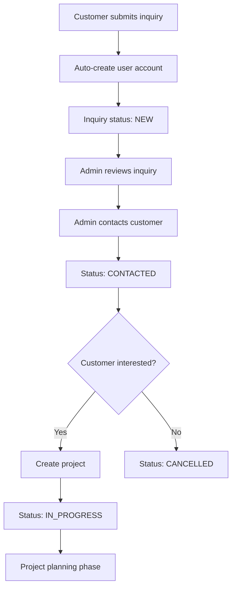
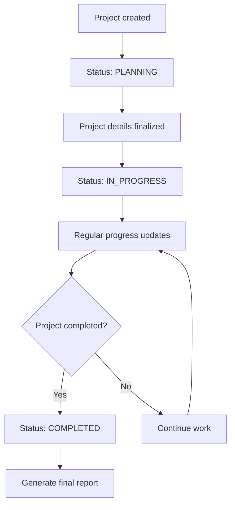
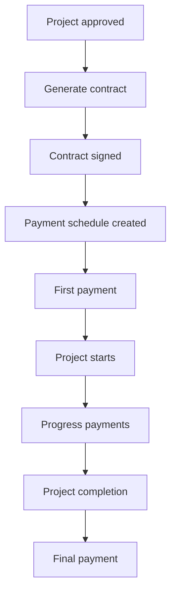

# Fitur dan Fungsionalitas - Aplikasi Ardfya v2

## 1. Gambaran Umum Fitur

Aplikasi Ardfya v2 adalah sistem manajemen layanan konstruksi dan arsitektur yang komprehensif dengan fitur-fitur utama:

- **Customer Management**: Pengelolaan data pelanggan
- **Service Management**: Pengelolaan layanan yang ditawarkan
- **Inquiry System**: Sistem permintaan layanan dari pelanggan
- **Project Management**: Pengelolaan proyek dari awal hingga selesai
- **Contract Management**: Pengelolaan kontrak dan pembayaran
- **Portfolio Management**: Pengelolaan portfolio proyek (NEW v2.1)
- **Real-time Communication**: Chat dan messaging system
- **Admin Dashboard**: Dashboard monitoring dan manajemen
- **Reporting System**: Laporan dan analitik

## 1.1 Update Setelah Cleanup (v2.1)

### Fitur Baru:
- ✅ **Portfolio Management**: Sistem manajemen portfolio terintegrasi
- ✅ **Dynamic Homepage**: Portfolio ditampilkan dari database
- ✅ **Featured Portfolio**: Sistem prioritas portfolio unggulan
- ✅ **Portfolio Detail Pages**: Halaman detail individual portfolio

### Optimisasi:
- ✅ **Performance**: Aplikasi lebih cepat tanpa fitur testing
- ✅ **Security**: Tidak ada endpoint testing yang exposed
- ✅ **Code Quality**: Struktur kode lebih bersih dan maintainable
- ✅ **Database Integration**: Homepage terintegrasi dengan portfolio database

## 2. Fitur untuk Customer/Pelanggan

### 2.1 Registrasi dan Autentikasi

**Fitur:**
- Registrasi akun baru dengan email verification
- Login dengan email dan password
- Password reset via email
- Profile management

**Business Logic:**
```php
// Auto-create user saat inquiry
$user = User::firstOrCreate(
    ['email' => $validated['email']],
    [
        'name' => $validated['name'],
        'phone' => $validated['phone'],
        'password' => bcrypt(Str::random(10)),
        'role' => 'customer'
    ]
);
```

**Workflow:**
1. Customer mengisi form inquiry
2. Sistem otomatis membuat akun jika email belum terdaftar
3. Password random digenerate dan bisa direset
4. Customer mendapat akses ke dashboard

### 2.2 Service Inquiry System

**Fitur:**
- Browse layanan yang tersedia
- Form inquiry dengan detail lengkap
- Upload dokumen pendukung
- Tracking status inquiry

**Form Fields:**
- **Personal Info**: Nama, email, telepon
- **Project Details**: Jenis properti, alamat, luas area
- **Requirements**: Budget, deskripsi kebutuhan, kondisi saat ini
- **Timeline**: Tanggal mulai diinginkan, fleksibilitas jadwal

**Validation Rules:**
```php
$validated = $request->validate([
    'service_id' => 'required|exists:services,id',
    'name' => 'required|string|max:255',
    'email' => 'required|email',
    'phone' => 'required|string',
    'address' => 'required|string',
    'property_type' => 'required|string',
    'area_size' => 'required|numeric',
    'budget' => 'required|numeric',
    'description' => 'required|string',
    'start_date' => 'nullable|date',
    'schedule_flexibility' => 'nullable|string',
    'current_condition' => 'nullable|string',
]);
```

**Status Flow:**
1. **New**: Inquiry baru diterima
2. **Contacted**: Admin sudah menghubungi customer
3. **In Progress**: Sedang diproses/survey
4. **Completed**: Inquiry selesai (menjadi proyek atau ditolak)
5. **Cancelled**: Dibatalkan

### 2.3 Real-time Communication

**Chat Features:**
- Real-time messaging dengan admin
- File attachment support
- Message read status
- Chat history

**Implementation:**
```javascript
// Laravel Echo untuk real-time
window.Echo.private('chat.' + userId)
    .listen('MessageSent', (e) => {
        appendMessage(e.message);
    });
```

**Message Types:**
- Text messages
- File attachments (images, documents)
- System notifications
- Status updates

### 2.4 Project Tracking

**Fitur:**
- View project progress
- Timeline tracking
- Photo gallery (before/after)
- Communication log

**Project Information:**
- Project details dan specifications
- Progress percentage
- Timeline (start, expected end, actual end)
- Budget dan cost tracking
- Photo documentation

## 3. Fitur untuk Admin

### 3.1 Dashboard Analytics

**Key Metrics:**
- Total customers
- Active inquiries
- Ongoing projects
- Contract values
- Payment status

**Dashboard Components:**
```php
// Dashboard data aggregation
$customerCount = User::where('role', 'customer')->count();
$inquiryCount = Inquiry::count();
$projectCount = Project::count();
$contractCount = Contract::count();

// Status breakdowns
$inquiriesByStatus = Inquiry::select('status', DB::raw('count(*) as count'))
    ->groupBy('status')
    ->get()
    ->pluck('count', 'status')
    ->toArray();
```

**Charts dan Visualizations:**
- Inquiry status distribution
- Project progress overview
- Revenue tracking
- Customer acquisition trends

### 3.2 Inquiry Management

**Admin Capabilities:**
- View all inquiries dengan filtering
- Update inquiry status
- Add admin notes
- Convert inquiry to project
- Bulk operations

**Filtering Options:**
- By status (new, contacted, in_progress, completed, cancelled)
- By service type
- By date range
- By customer

**Inquiry Actions:**
```php
// Update inquiry status
public function updateStatus(Request $request, Inquiry $inquiry)
{
    $inquiry->update([
        'status' => $request->status,
        'admin_notes' => $request->admin_notes
    ]);
    
    // Send notification to customer
    // Log activity
}
```

### 3.3 Project Management

**Project Lifecycle:**
1. **Planning**: Initial project setup
2. **In Progress**: Active development
3. **On Hold**: Temporarily paused
4. **Completed**: Successfully finished
5. **Cancelled**: Terminated

**Project Features:**
- Create project from inquiry
- Assign team members
- Track progress percentage
- Manage timeline
- Upload project photos
- Generate reports

**Project Validation:**
```php
$validated = $request->validate([
    'name' => 'required|string|max:255',
    'user_id' => 'required|exists:users,id',
    'service_id' => 'required|exists:services,id',
    'inquiry_id' => 'nullable|exists:inquiries,id',
    'description' => 'required|string',
    'start_date' => 'required|date',
    'expected_end_date' => 'nullable|date|after_or_equal:start_date',
    'budget' => 'required|numeric|min:0',
    'progress_percentage' => 'required|integer|min:0|max:100',
]);
```

### 3.4 Contract Management

**Contract Features:**
- Generate contract from project
- Auto-generate contract numbers
- Payment tracking
- Installment management
- PDF generation

**Contract Number Generation:**
```php
public static function generateContractNumber(): string
{
    $prefix = 'CTR';
    $year = date('Y');
    $month = date('m');
    
    $lastContract = static::where('contract_number', 'like', "{$prefix}-{$year}{$month}%")
        ->orderBy('id', 'desc')
        ->first();
        
    $sequence = $lastContract ? 
        (int) substr(explode('-', $lastContract->contract_number)[2], -4) + 1 : 1;
    
    return sprintf('%s-%s%s-%04d', $prefix, $year, $month, $sequence);
}
```

**Payment Tracking:**
- Payment history
- Remaining balance calculation
- Payment percentage
- Receipt management

### 3.5 Customer Management

**Customer Features:**
- View customer profiles
- Communication history
- Project history
- Payment history
- Customer notes

**Customer Analytics:**
- Customer lifetime value
- Project completion rate
- Communication frequency
- Satisfaction metrics

## 4. Business Logic dan Workflows

### 4.1 Inquiry to Project Workflow



### 4.2 Project Management Workflow



### 4.3 Contract and Payment Workflow



## 5. Sistem Notifikasi

### 5.1 Real-time Notifications

**Event Types:**
- New inquiry received
- Project status updates
- Payment received
- Message notifications
- System alerts

**Implementation:**
```php
// Broadcasting events
broadcast(new InquiryReceived($inquiry))->toOthers();
broadcast(new ProjectUpdated($project))->toOthers();
broadcast(new MessageSent($message))->toOthers();
```

### 5.2 Email Notifications

**Email Types:**
- Welcome email untuk customer baru
- Inquiry confirmation
- Project status updates
- Payment reminders
- Contract notifications

## 6. Reporting dan Analytics

### 6.1 Admin Reports

**Available Reports:**
- Monthly inquiry report
- Project completion report
- Revenue report
- Customer satisfaction report
- Performance metrics

### 6.2 Customer Reports

**Customer Access:**
- Project progress report
- Payment history
- Communication log
- Photo gallery

## 7. Security Features

### 7.1 Authentication & Authorization

**Security Measures:**
- Role-based access control (RBAC)
- CSRF protection
- SQL injection prevention
- XSS protection
- Password hashing

**Middleware Implementation:**
```php
// AdminMiddleware
public function handle($request, Closure $next)
{
    if (!Auth::check() || !Auth::user()->isAdmin()) {
        return redirect()->route('login')
            ->with('error', 'Unauthorized access.');
    }
    
    return $next($request);
}
```

### 7.2 Data Validation

**Input Validation:**
- Server-side validation untuk semua forms
- Client-side validation untuk UX
- File upload validation
- Data sanitization

### 7.3 Error Handling

**Error Management:**
- Comprehensive error logging
- User-friendly error messages
- Graceful error recovery
- Database transaction rollback

```php
try {
    DB::beginTransaction();
    // Business logic
    DB::commit();
} catch (\Exception $e) {
    DB::rollBack();
    Log::error('Operation failed: ' . $e->getMessage());
    return back()->with('error', 'Operation failed.');
}
```

## 8. Performance Optimization

### 8.1 Database Optimization

**Optimization Techniques:**
- Eager loading untuk relationships
- Database indexing
- Query optimization
- Pagination untuk large datasets

```php
// Efficient data loading
$projects = Project::with(['service', 'user', 'inquiry'])
    ->where('status', 'active')
    ->paginate(10);
```

### 8.2 Caching Strategy

**Caching Implementation:**
- Route caching
- Config caching
- View caching
- Query result caching

---

*Sistem fitur ini dirancang untuk memberikan pengalaman yang seamless bagi customer dan tools yang powerful bagi admin dalam mengelola bisnis konstruksi dan arsitektur.*
