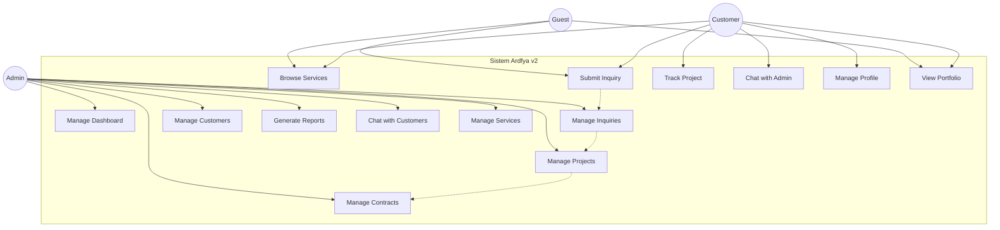
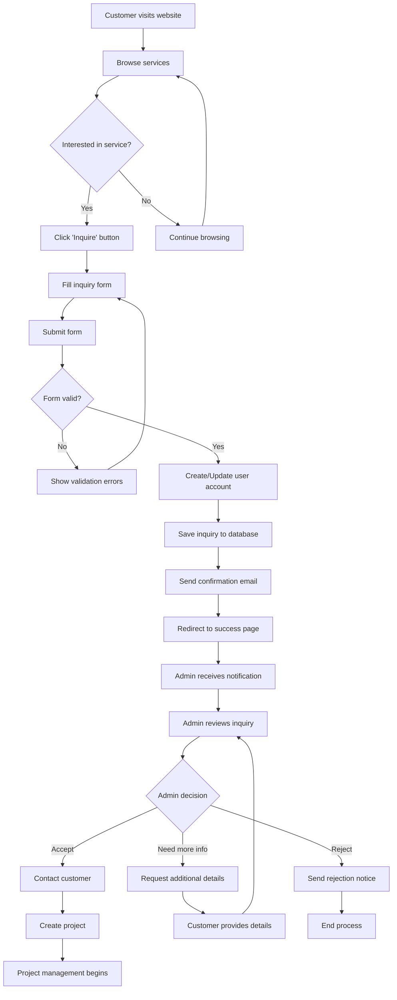
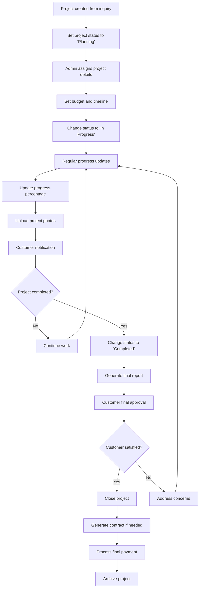
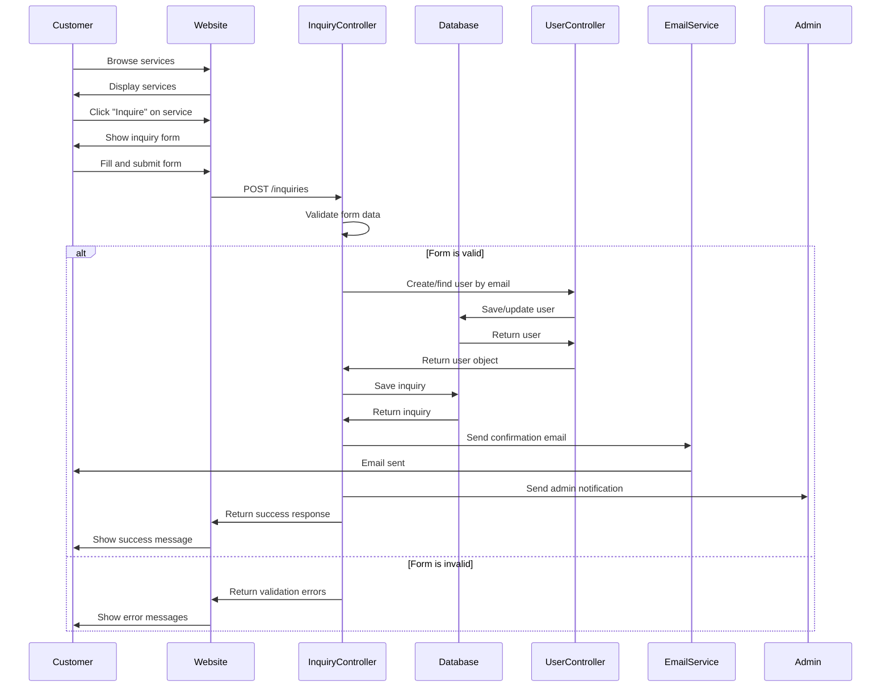
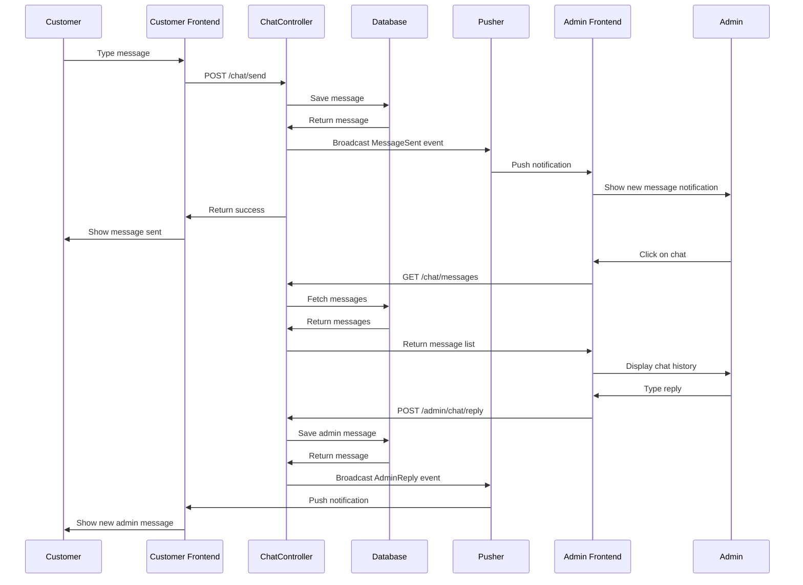
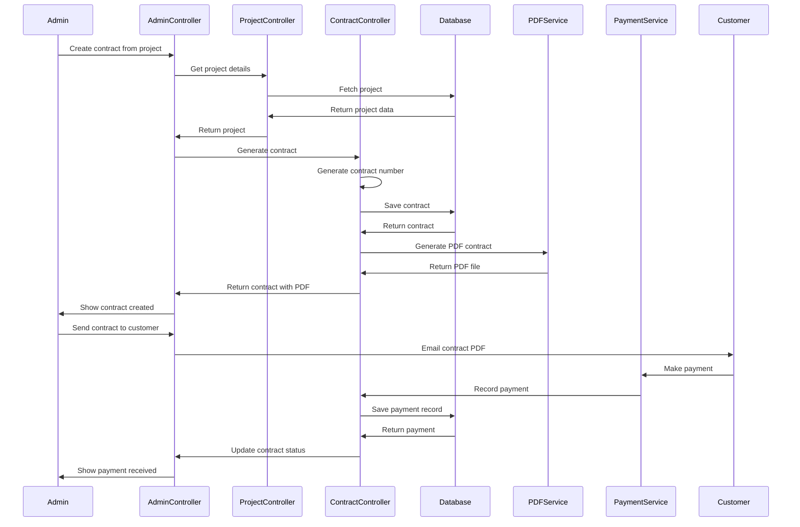

# Diagram UML - Aplikasi Ardfya v2

## 1. Use Case Diagram

Use Case Diagram menggambarkan interaksi antara aktor (users) dengan sistem dan fitur-fitur yang tersedia.



## 2. Class Diagram

Class Diagram menunjukkan struktur kelas dalam sistem dan hubungan antar kelas.

```mermaid
classDiagram
    class User {
        +Long id
        +String name
        +String email
        +String password
        +String phone
        +String address
        +String role
        +DateTime created_at
        +DateTime updated_at
        +isAdmin() Boolean
        +projects() HasMany
        +inquiries() HasMany
        +messages() HasMany
        +contracts() HasMany
    }
    
    class Service {
        +Long id
        +String name
        +String slug
        +Text description
        +String short_description
        +String image_path
        +String icon
        +String price_range
        +Boolean is_featured
        +Boolean is_active
        +Integer ordering
        +DateTime created_at
        +DateTime updated_at
        +projects() HasMany
        +inquiries() HasMany
    }
    
    class Inquiry {
        +Long id
        +Long user_id
        +Long service_id
        +String name
        +String email
        +String phone
        +String property_type
        +String address
        +Integer area_size
        +Decimal budget
        +Text description
        +String status
        +Text admin_notes
        +Date start_date
        +String schedule_flexibility
        +Text current_condition
        +DateTime created_at
        +DateTime updated_at
        +user() BelongsTo
        +service() BelongsTo
        +project() HasOne
        +messages() HasMany
    }
    
    class Project {
        +Long id
        +Long user_id
        +Long service_id
        +Long inquiry_id
        +String name
        +Text description
        +String status
        +Date start_date
        +Date expected_end_date
        +Date actual_end_date
        +String address
        +Decimal total_cost
        +Decimal budget
        +String thumbnail
        +String category
        +Boolean is_featured
        +Integer progress_percentage
        +Text notes
        +DateTime created_at
        +DateTime updated_at
        +user() BelongsTo
        +service() BelongsTo
        +inquiry() BelongsTo
        +contract() HasOne
        +projectImages() HasMany
        +messages() HasMany
    }
    
    class Contract {
        +Long id
        +Long project_id
        +Long user_id
        +String contract_number
        +Date start_date
        +Date end_date
        +Decimal amount
        +Decimal paid_amount
        +String contract_file
        +String payment_status
        +String contract_status
        +Date last_payment_date
        +String payment_method
        +Integer installments
        +Text notes
        +DateTime created_at
        +DateTime updated_at
        +project() BelongsTo
        +user() BelongsTo
        +payments() HasMany
        +getRemainingAmountAttribute() Decimal
        +getPaymentPercentageAttribute() Integer
        +generateContractNumber() String
    }
    
    class ContractPayment {
        +Long id
        +Long contract_id
        +Long user_id
        +Decimal amount
        +Date payment_date
        +String payment_method
        +String transaction_id
        +String receipt_number
        +Text notes
        +String receipt_file
        +String status
        +DateTime created_at
        +DateTime updated_at
        +contract() BelongsTo
        +user() BelongsTo
    }
    
    class Message {
        +Long id
        +Long user_id
        +Long project_id
        +Long inquiry_id
        +Text message
        +Boolean is_from_admin
        +Boolean is_read
        +DateTime created_at
        +DateTime updated_at
        +user() BelongsTo
        +project() BelongsTo
        +inquiry() BelongsTo
    }
    
    class Chat {
        +Long id
        +Long customer_id
        +Long admin_id
        +Text message
        +Boolean is_from_admin
        +Boolean is_read
        +String file_url
        +String file_name
        +String file_type
        +Integer file_size
        +DateTime created_at
        +DateTime updated_at
        +customer() BelongsTo
        +admin() BelongsTo
    }
    
    class ProjectImage {
        +Long id
        +Long project_id
        +String image_path
        +Text caption
        +Integer ordering
        +Boolean is_before_image
        +Boolean is_after_image
        +Boolean is_featured
        +DateTime created_at
        +DateTime updated_at
        +project() BelongsTo
    }
    
    %% Relationships
    User ||--o{ Inquiry : "has many"
    User ||--o{ Project : "has many"
    User ||--o{ Contract : "has many"
    User ||--o{ Message : "has many"
    User ||--o{ Chat : "customer"
    User ||--o{ Chat : "admin"
    User ||--o{ ContractPayment : "has many"
    
    Service ||--o{ Inquiry : "has many"
    Service ||--o{ Project : "has many"
    
    Inquiry ||--|| User : "belongs to"
    Inquiry ||--|| Service : "belongs to"
    Inquiry ||--o| Project : "has one"
    Inquiry ||--o{ Message : "has many"
    
    Project ||--|| User : "belongs to"
    Project ||--|| Service : "belongs to"
    Project ||--|| Inquiry : "belongs to"
    Project ||--o| Contract : "has one"
    Project ||--o{ ProjectImage : "has many"
    Project ||--o{ Message : "has many"
    
    Contract ||--|| Project : "belongs to"
    Contract ||--|| User : "belongs to"
    Contract ||--o{ ContractPayment : "has many"
    
    ContractPayment ||--|| Contract : "belongs to"
    ContractPayment ||--|| User : "belongs to"
    
    Message ||--|| User : "belongs to"
    Message ||--|| Project : "belongs to"
    Message ||--|| Inquiry : "belongs to"
    
    Chat ||--|| User : "customer"
    Chat ||--|| User : "admin"
    
    ProjectImage ||--|| Project : "belongs to"
```

## 3. Activity Diagram

### 3.1 Customer Inquiry Process



### 3.2 Project Management Process



## 4. Sequence Diagram

### 4.1 Customer Inquiry Submission



### 4.2 Real-time Chat Communication



### 4.3 Contract Generation and Payment



---

*Diagram UML ini memberikan visualisasi yang komprehensif tentang struktur, alur kerja, dan interaksi dalam sistem Ardfya v2, memudahkan pemahaman arsitektur dan proses bisnis aplikasi.*
