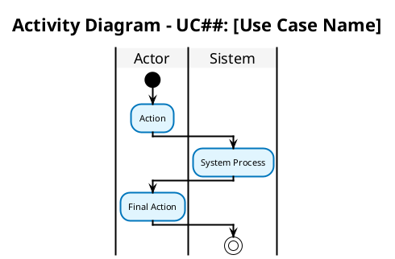

# 📊 Activity Diagram v2.1 - ARDFYA

## 📋 Overview

Activity Diagram v2.1 dibuat berdasarkan **Use Case Diagram terbaru** dengan menerapkan **standar UML BPMN yang tegas** dan memastikan setiap diagram memiliki **single end point**.

## 🎯 Prinsip Desain

### **✅ Standar UML BPMN yang Diterapkan:**
1. **Single Start Point** - Setiap diagram dimulai dari satu titik start
2. **Single End Point** - Setiap diagram berakhir di satu titik stop
3. **Clear Swimlanes** - Pemisahan yang jelas antara Actor dan Sistem
4. **Proper Decision Points** - Diamond shape untuk decision dengan Yes/No
5. **Merge Points** - Semua parallel flows harus merge sebelum end
6. **Consistent Notation** - Notasi yang konsisten di semua diagram

### **🎨 Visual Standards:**
- **Orthogonal Lines** - Garis lurus dan rapi
- **Consistent Spacing** - Jarak yang konsisten antar elemen
- **Professional Colors** - Warna yang konsisten dan professional
- **Clear Labels** - Label yang jelas dan mudah dibaca

## 📁 Daftar Activity Diagrams (17 Diagrams)

### **🔐 Authentication & Registration**
1. **01-login.puml** - Login (Customer, Admin, Guest) ✅
2. **13-registrasi-akun.puml** - Registrasi Akun (Guest) ✅

### **👤 Customer Activities**
3. **07-dashboard-customer.puml** - Lihat Dashboard Customer ✅
4. **08-kelola-profil-customer.puml** - Kelola Profil Customer ✅
5. **09-ajukan-inquiry.puml** - Ajukan Inquiry (Guest, Customer) ✅
6. **06-chat-dengan-admin.puml** - Chat dengan Admin (Customer) ✅
7. **11-lihat-status-project.puml** - Lihat Status Project (Customer) ✅
8. **12-download-kontrak-pdf.puml** - Download Kontrak PDF (Customer) ✅

### **👨‍💼 Admin Activities**
9. **10-dashboard-admin.puml** - Lihat Dashboard Admin ✅
10. **02-proses-inquiry.puml** - Proses Inquiry (Admin) ✅
11. **03-kelola-data-customer.puml** - Kelola Data Customer (Admin) ✅
12. **04-kelola-portfolio.puml** - Kelola Portfolio (Admin) ✅
13. **05-chat-dengan-customer.puml** - Chat dengan Customer (Admin) ✅
14. **14-kelola-project.puml** - Kelola Project (Admin) ✅
15. **15-generate-kontrak.puml** - Generate Kontrak (Admin) ✅
16. **16-lihat-detail-inquiry.puml** - Lihat Detail Inquiry (Admin) ✅

### **🌐 Public Activities**
17. **17-lihat-portfolio.puml** - Lihat Portfolio (Guest) ✅

## ✅ **Status: COMPLETE - All 17 Activity Diagrams Created**

## 🔄 Relationships & Dependencies

### **Include Relationships:**
- **Ajukan Inquiry** include **Registrasi Akun**
- **Proses Inquiry** include **Kelola Project**
- **Kelola Project** include **Generate Kontrak**

### **Extend Relationships:**
- **Lihat Detail Inquiry** extend **Proses Inquiry**

## 📊 Actors & Responsibilities

### **👤 Guest**
- Lihat Portfolio
- Ajukan Inquiry (dengan registrasi)
- Registrasi Akun
- Login

### **👨‍💼 Customer**
- Login
- Dashboard Customer
- Kelola Profil
- Ajukan Inquiry
- Chat dengan Admin
- Lihat Status Project
- Download Kontrak PDF

### **👨‍💼 Admin**
- Login
- Dashboard Admin
- Proses Inquiry
- Kelola Data Customer
- Kelola Portfolio
- Chat dengan Customer
- Kelola Project
- Generate Kontrak
- Lihat Detail Inquiry

## 🎨 Template Standard

Setiap activity diagram menggunakan template standard berikut:

## 📝 Notes

- Semua diagram menggunakan **single end point**
- Notasi UML BPMN yang **tegas dan konsisten**
- **Merge points** untuk menggabungkan parallel flows
- **Professional styling** yang mudah dibaca
- **Clear separation** antara Actor dan Sistem

---
**Created**: 2025-01-16  
**Version**: 2.1  
**Standard**: UML BPMN Compliant
