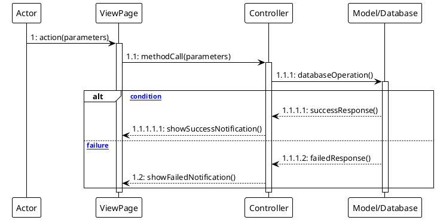

# 📊 Sequence Diagram v2.1 - ARDFYA

## 📋 Overview

Sequence Diagram v2.1 dibuat berdasarkan **Activity Diagram v2.1** dan **Class Diagram** dengan menerapkan **notasi UML BPMN yang tegas** sesuai format contoh yang diberikan.

## 🎯 Prinsip Desain

### **✅ Format Sesuai Contoh:**
1. **3 Objek Utama** - Actor, View/Page, Controller
2. **Database/Model Integration** - Sesuai dengan class diagram
3. **Method Calls** - Berkesinambungan dengan class diagram methods
4. **Activation Boxes** - Menunjukkan object lifecycle
5. **Return Messages** - Dashed lines untuk response
6. **Alt Blocks** - Untuk conditional logic

### **🎨 Visual Standards:**
- **Consistent Layout** - Sesuai dengan contoh gambar
- **Professional Styling** - Clean dan mudah dibaca
- **Proper Numbering** - Sequential message numbering
- **Clear Lifelines** - Vertical dashed lines
- **Activation Periods** - Rectangle boxes pada lifelines

## 📁 Daftar Sequence Diagrams (17 Diagrams)

### **🔐 Authentication & Registration**
1. **01-login-sequence.puml** - Login Process ✅
2. **13-registrasi-akun-sequence.puml** - Registration Process ✅

### **👤 Customer Activities**
3. **07-dashboard-customer-sequence.puml** - Customer Dashboard ✅
4. **08-kelola-profil-customer-sequence.puml** - Customer Profile Management ✅
5. **09-ajukan-inquiry-sequence.puml** - Submit Inquiry ✅
6. **06-chat-dengan-admin-sequence.puml** - Customer Chat ✅
7. **11-lihat-status-project-sequence.puml** - View Project Status ✅
8. **12-download-kontrak-pdf-sequence.puml** - Download Contract PDF ✅

### **👨‍💼 Admin Activities**
9. **10-dashboard-admin-sequence.puml** - Admin Dashboard ✅
10. **02-proses-inquiry-sequence.puml** - Process Inquiry ✅
11. **03-kelola-data-customer-sequence.puml** - Manage Customer Data ✅
12. **04-kelola-portfolio-sequence.puml** - Manage Portfolio ✅
13. **05-chat-dengan-customer-sequence.puml** - Admin Chat ✅
14. **14-kelola-project-sequence.puml** - Manage Project ✅
15. **15-generate-kontrak-sequence.puml** - Generate Contract ✅
16. **16-lihat-detail-inquiry-sequence.puml** - View Inquiry Detail ✅

### **🌐 Public Activities**
17. **17-lihat-portfolio-sequence.puml** - View Portfolio ✅

## ✅ **Status: COMPLETE - All 17 Sequence Diagrams Created**

## 🔄 Object Interactions

### **Standard Pattern:**
```
Actor -> View/Page -> Controller -> Model/Database
```

### **Method Mapping dari Class Diagram:**
- **User Model**: isAdmin(), isCustomer(), inquiries(), projects()
- **Inquiry Model**: user(), service(), scopeByStatus()
- **Project Model**: user(), contract(), getStatusColorAttribute()
- **Contract Model**: generatePDF(), getFormattedAmountAttribute()
- **Portfolio Model**: scopeActive(), scopeFeatured()
- **Chat Model**: markAsRead(), scopeUnread()

## 📊 Controllers & Methods Used

### **Authentication Controllers:**
- **LoginController**: authenticate(), redirectTo()
- **RegisterController**: create(), store(), verify()

### **Customer Controllers:**
- **CustomerDashboardController**: index()
- **InquiryController**: create(), store()
- **ChatController**: getMessages(), store()

### **Admin Controllers:**
- **AdminDashboardController**: index()
- **AdminInquiryController**: index(), show(), update()
- **AdminProjectController**: index(), store(), update()
- **AdminContractController**: generatePDF()
- **AdminPortfolioController**: index(), store(), update()

## 🎨 Template Standard

Setiap sequence diagram menggunakan format sesuai contoh:



---
**Created**: 2025-01-16  
**Version**: 2.1  
**Standard**: UML BPMN Compliant  
**Based on**: Activity Diagram v2.1 & Class Diagram
