# 🏗️ Arsitektur Web Aplikasi ARDFYA v2.1

## 📋 Overview Arsitektur

ARDFYA v2.1 menggunakan arsitektur **3-Tier Architecture** dengan pola **MVC (Model-View-Controller)** yang diimplementasikan menggunakan Laravel framework. Sistem ini dirancang untuk memberikan skalabilitas, maintainability, dan performance yang optimal.

## 🎯 Diagram Arsitektur Sistem

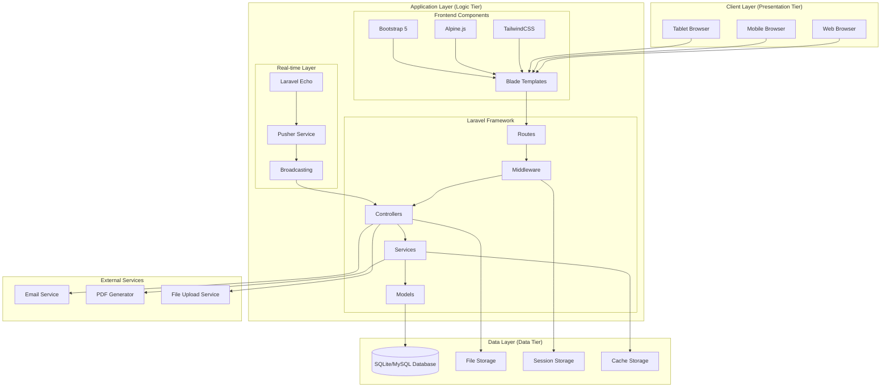

## 🔧 Komponen Arsitektur Detail

### **1. Client Layer (Presentation Tier)**

#### **Web Browser Support**
- **Desktop Browsers**: Chrome, Firefox, Safari, Edge
- **Mobile Browsers**: Mobile Chrome, Mobile Safari
- **Tablet Support**: iPad, Android tablets
- **Responsive Design**: Automatic adaptation untuk semua screen sizes

#### **Frontend Technologies**
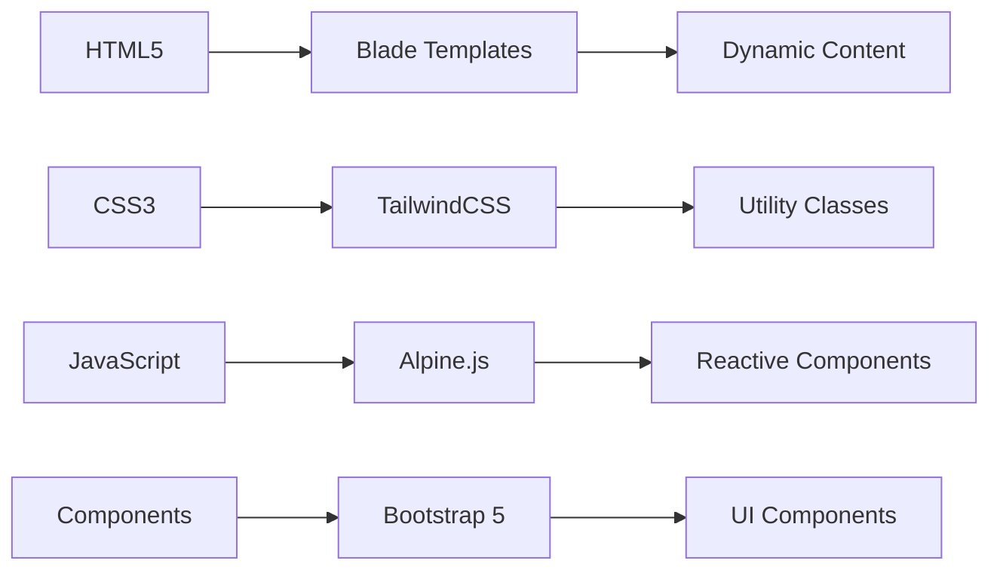

### **2. Application Layer (Logic Tier)**

#### **A. Frontend Framework Stack**

##### **Blade Templating Engine**
- **Fungsi**: Server-side rendering dengan dynamic content
- **Fitur**: Template inheritance, components, directives
- **Integrasi**: Seamless dengan Laravel backend

##### **TailwindCSS Framework**
- **Fungsi**: Utility-first CSS framework
- **Fitur**: Responsive design, custom components
- **Optimisasi**: Purge unused CSS untuk performance

##### **Alpine.js Framework**
- **Fungsi**: Lightweight JavaScript framework
- **Fitur**: Reactive data binding, component state management
- **Integrasi**: Perfect untuk Laravel Blade templates

##### **Bootstrap 5 Components**
- **Fungsi**: Pre-built UI components
- **Fitur**: Modal, dropdown, navigation, forms
- **Customization**: Themed untuk ARDFYA branding

#### **B. Laravel Backend Architecture**

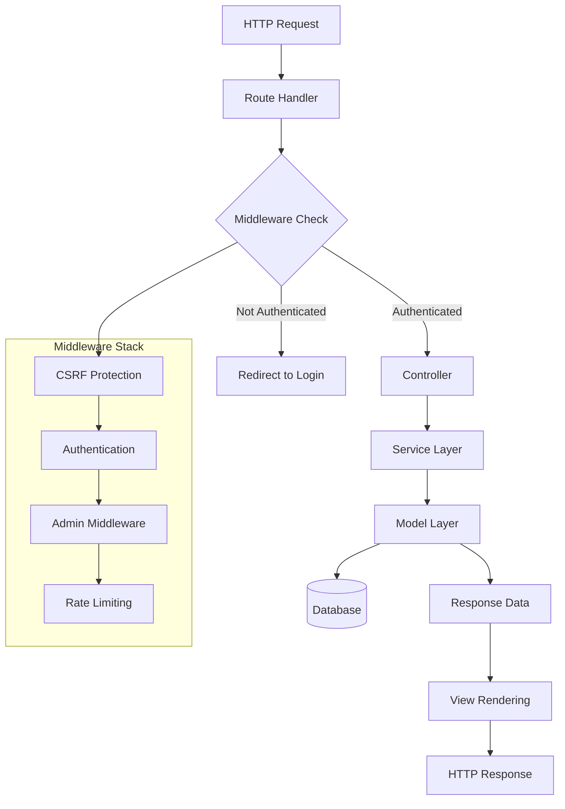

##### **Route Management**
- **Web Routes**: `/routes/web.php` - Main application routes
- **API Routes**: `/routes/api.php` - AJAX dan real-time endpoints
- **Route Groups**: Organized by functionality dan middleware

##### **Middleware System**
- **AdminMiddleware**: Role-based access control
- **Auth Middleware**: Authentication verification
- **CSRF Protection**: Security against cross-site attacks
- **Rate Limiting**: API request throttling

##### **Controller Architecture**
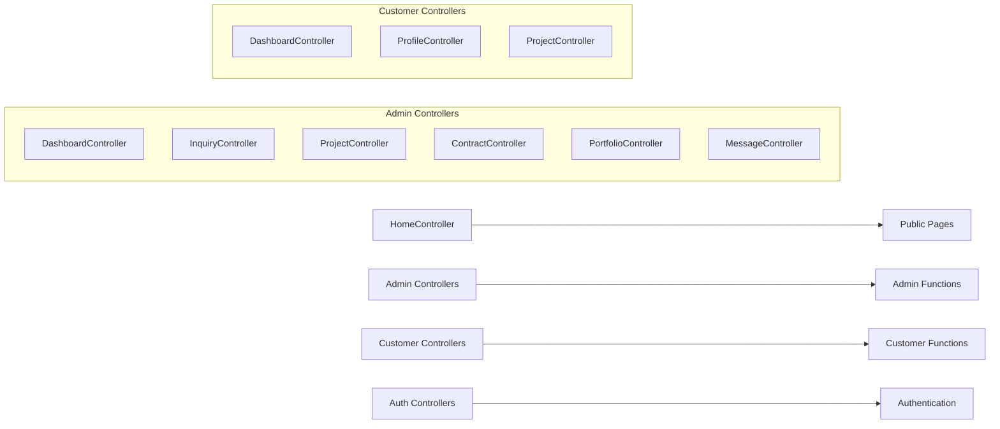

##### **Service Layer Pattern**
- **Business Logic**: Separated dari controllers
- **Reusability**: Shared logic across controllers
- **Testing**: Easier unit testing
- **Maintenance**: Better code organization

##### **Model Layer (Eloquent ORM)**
- **Active Record Pattern**: Object-relational mapping
- **Relationships**: Defined model relationships
- **Scopes**: Reusable query logic
- **Mutators/Accessors**: Data transformation

#### **C. Real-time Communication Layer**

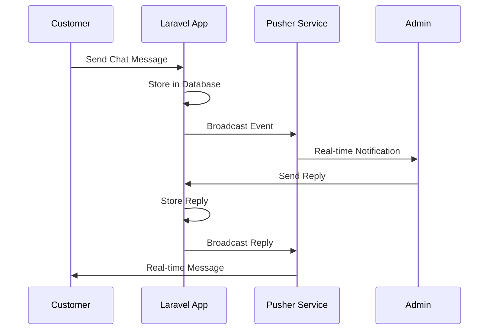

##### **Laravel Echo Integration**
- **WebSocket Client**: Real-time communication
- **Event Broadcasting**: Server-to-client messaging
- **Channel Authentication**: Secure private channels

##### **Pusher Service**
- **Real-time Delivery**: Instant message delivery
- **Scalability**: Handle multiple concurrent connections
- **Reliability**: Message delivery guarantee

### **3. Data Layer (Data Tier)**

#### **Database Architecture**

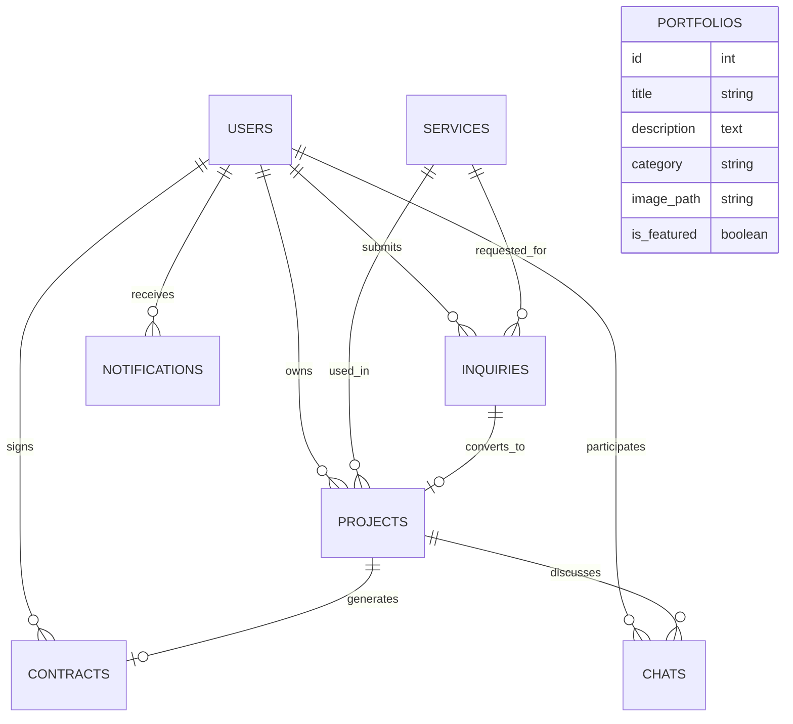

#### **Storage Systems**

##### **Database Storage**
- **Development**: SQLite (portable, zero-config)
- **Production**: MySQL/PostgreSQL (scalable, robust)
- **Migrations**: Version control untuk database schema
- **Seeders**: Sample data untuk development

##### **File Storage**
- **Local Storage**: Development file storage
- **Cloud Storage**: Production file storage (S3, etc.)
- **Image Processing**: Automatic optimization
- **Security**: File type validation

##### **Session & Cache**
- **Session Storage**: User session management
- **Cache Storage**: Performance optimization
- **Redis Support**: Advanced caching (optional)

## 🔄 Data Flow Architecture

### **1. Request-Response Cycle**

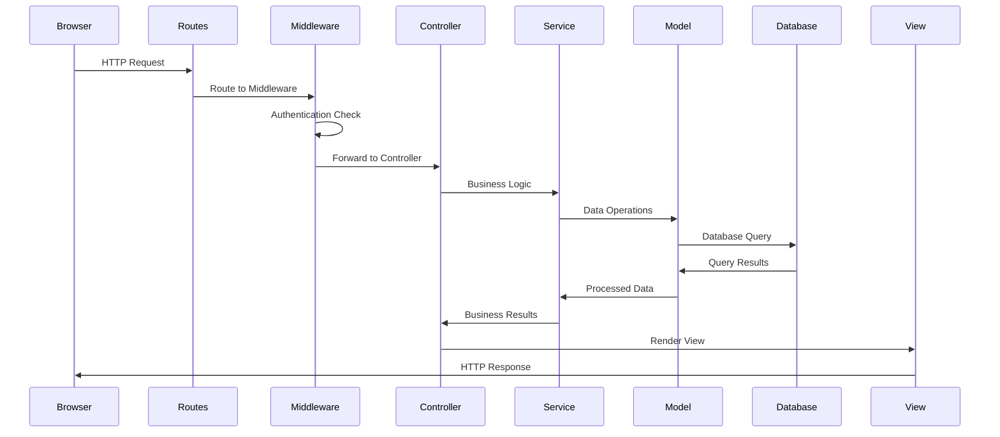

### **2. Real-time Communication Flow**

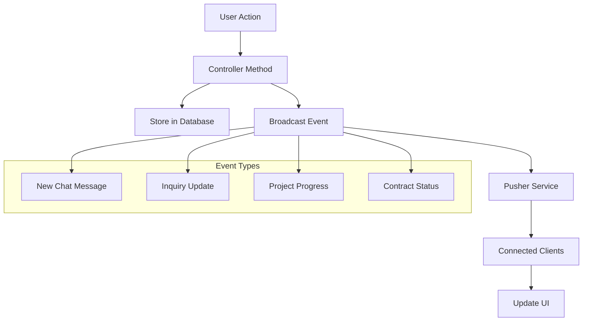

## 🛡️ Security Architecture

### **Authentication & Authorization**

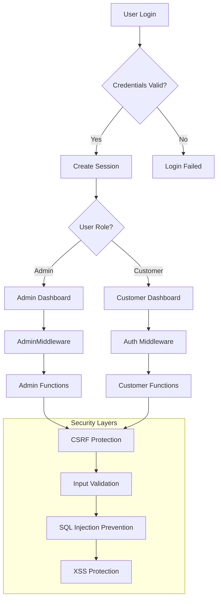

### **Security Features**
- **CSRF Protection**: Built-in Laravel protection
- **Input Validation**: Form request validation
- **SQL Injection Prevention**: Eloquent ORM protection
- **XSS Protection**: Blade template escaping
- **File Upload Security**: Type dan size validation
- **Rate Limiting**: API request throttling

## 📊 Performance Architecture

### **Optimization Strategies**

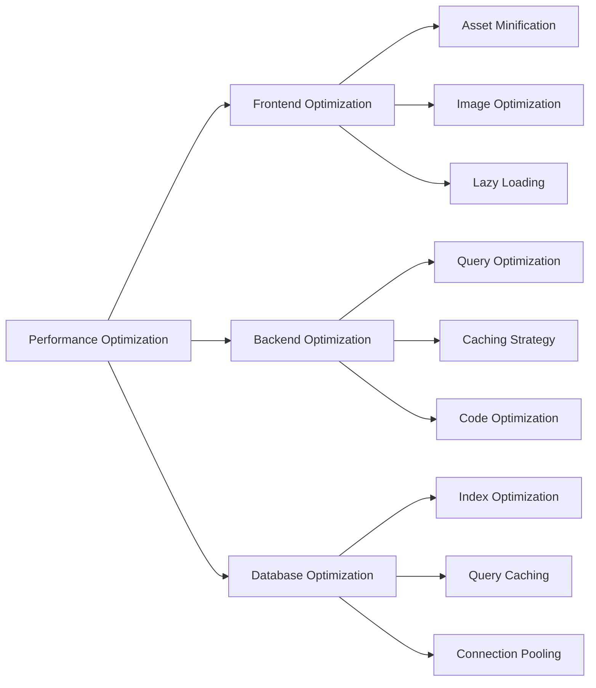

### **Caching Strategy**
- **View Caching**: Compiled Blade templates
- **Route Caching**: Optimized route resolution
- **Config Caching**: Configuration optimization
- **Query Caching**: Database query results
- **Asset Caching**: Static file caching

## 🚀 Deployment Architecture

### **Development Environment**
```
Local Development → SQLite → File Storage → Local Server
```

### **Production Environment**
```
Load Balancer → Web Servers → MySQL/PostgreSQL → Cloud Storage
```

### **CI/CD Pipeline**
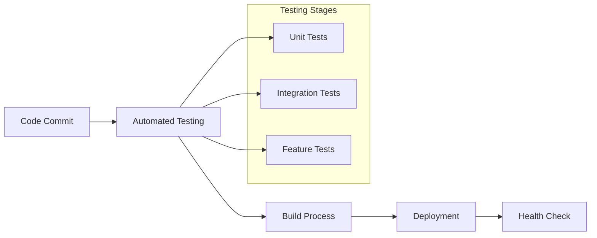

## 📈 Scalability Considerations

### **Horizontal Scaling**
- **Load Balancing**: Multiple web server instances
- **Database Clustering**: Master-slave configuration
- **File Storage**: Distributed storage systems
- **Cache Distribution**: Redis clustering

### **Vertical Scaling**
- **Server Resources**: CPU, RAM, Storage upgrades
- **Database Optimization**: Query performance tuning
- **Application Optimization**: Code efficiency improvements

---

**Arsitektur ARDFYA v2.1** dirancang untuk memberikan **performance**, **scalability**, dan **maintainability** yang optimal untuk bisnis konstruksi dan arsitektur modern. 🏗️
