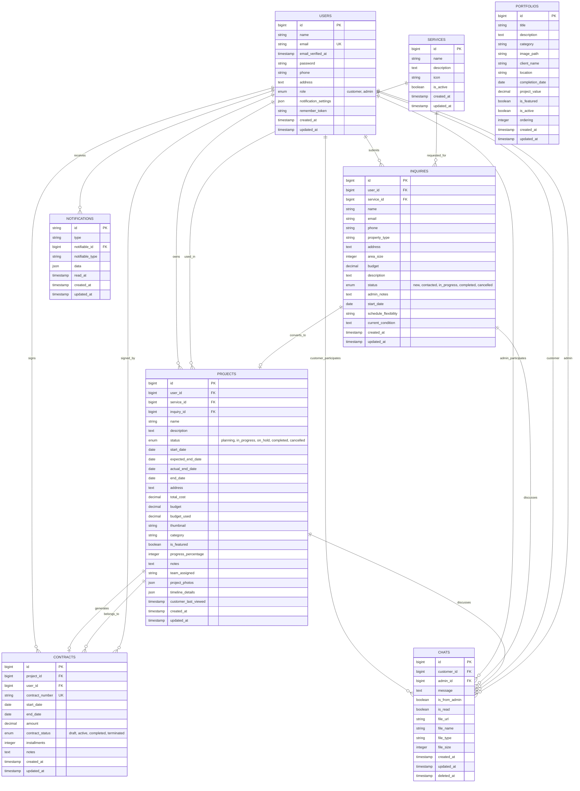

# 🗄️ Entity Relationship Diagram (ERD) - Database ARDFYA v2.1

## 📋 Overview Database

Database ARDFYA v2.1 dirancang dengan pendekatan **normalized relational database** yang mengoptimalkan integritas data, performance, dan scalability. Sistem menggunakan **8 tabel utama** dengan relasi yang well-defined untuk mendukung seluruh business process.

## 🎯 ERD Diagram Lengkap



## 📊 Detail Tabel Database

### **1. USERS Table**

#### **Struktur Tabel**
| Field | Type | Constraint | Description |
|-------|------|------------|-------------|
| id | BIGINT | PRIMARY KEY, AUTO_INCREMENT | ID unik user |
| name | VARCHAR(255) | NOT NULL | Nama lengkap user |
| email | VARCHAR(255) | UNIQUE, NOT NULL | Email address |
| email_verified_at | TIMESTAMP | NULLABLE | Waktu verifikasi email |
| password | VARCHAR(255) | NOT NULL | Password ter-hash |
| phone | VARCHAR(255) | NULLABLE | Nomor telepon |
| address | TEXT | NULLABLE | Alamat lengkap |
| role | ENUM | DEFAULT 'customer' | Role: customer/admin |
| notification_settings | JSON | NULLABLE | Pengaturan notifikasi |
| remember_token | VARCHAR(100) | NULLABLE | Token remember me |
| created_at | TIMESTAMP | NOT NULL | Waktu pembuatan |
| updated_at | TIMESTAMP | NOT NULL | Waktu update terakhir |

#### **Business Rules**
- Email harus unique di seluruh sistem
- Role default adalah 'customer'
- Password di-hash menggunakan bcrypt
- Notification settings dalam format JSON

### **2. SERVICES Table**

#### **Struktur Tabel**
| Field | Type | Constraint | Description |
|-------|------|------------|-------------|
| id | BIGINT | PRIMARY KEY, AUTO_INCREMENT | ID unik service |
| name | VARCHAR(255) | NOT NULL | Nama layanan |
| description | TEXT | NOT NULL | Deskripsi layanan |
| icon | VARCHAR(255) | NOT NULL | Icon class (FontAwesome) |
| is_active | BOOLEAN | DEFAULT TRUE | Status aktif layanan |
| created_at | TIMESTAMP | NOT NULL | Waktu pembuatan |
| updated_at | TIMESTAMP | NOT NULL | Waktu update terakhir |

#### **Business Rules**
- Hanya service yang is_active=true yang ditampilkan di frontend
- Icon menggunakan FontAwesome class names
- Service dapat di-nonaktifkan tanpa menghapus data

### **3. INQUIRIES Table**

#### **Struktur Tabel**
| Field | Type | Constraint | Description |
|-------|------|------------|-------------|
| id | BIGINT | PRIMARY KEY, AUTO_INCREMENT | ID unik inquiry |
| user_id | BIGINT | FOREIGN KEY, NULLABLE | Referensi ke users.id |
| service_id | BIGINT | FOREIGN KEY | Referensi ke services.id |
| name | VARCHAR(255) | NOT NULL | Nama customer |
| email | VARCHAR(255) | NOT NULL | Email customer |
| phone | VARCHAR(255) | NOT NULL | Nomor telepon |
| property_type | VARCHAR(255) | NULLABLE | Jenis properti |
| address | TEXT | NOT NULL | Alamat proyek |
| area_size | INTEGER | NULLABLE | Luas area (m²) |
| budget | DECIMAL(12,2) | NULLABLE | Budget yang dimiliki |
| description | TEXT | NOT NULL | Deskripsi kebutuhan |
| status | ENUM | DEFAULT 'new' | Status: new/contacted/in_progress/completed/cancelled |
| admin_notes | TEXT | NULLABLE | Catatan admin |
| start_date | DATE | NULLABLE | Tanggal mulai diinginkan |
| schedule_flexibility | VARCHAR(255) | NULLABLE | Fleksibilitas jadwal |
| current_condition | TEXT | NULLABLE | Kondisi saat ini |
| created_at | TIMESTAMP | NOT NULL | Waktu pembuatan |
| updated_at | TIMESTAMP | NOT NULL | Waktu update terakhir |

#### **Business Rules**
- user_id bisa NULL untuk guest inquiry
- Inquiry dapat dikonversi menjadi project
- Status tracking untuk workflow management
- Admin notes untuk internal communication

### **4. PROJECTS Table**

#### **Struktur Tabel**
| Field | Type | Constraint | Description |
|-------|------|------------|-------------|
| id | BIGINT | PRIMARY KEY, AUTO_INCREMENT | ID unik project |
| user_id | BIGINT | FOREIGN KEY | Referensi ke users.id |
| service_id | BIGINT | FOREIGN KEY | Referensi ke services.id |
| inquiry_id | BIGINT | FOREIGN KEY, NULLABLE | Referensi ke inquiries.id |
| name | VARCHAR(255) | NOT NULL | Nama proyek |
| description | TEXT | NULLABLE | Deskripsi proyek |
| status | ENUM | DEFAULT 'planning' | Status: planning/in_progress/on_hold/completed/cancelled |
| start_date | DATE | NULLABLE | Tanggal mulai aktual |
| expected_end_date | DATE | NULLABLE | Tanggal selesai yang diharapkan |
| actual_end_date | DATE | NULLABLE | Tanggal selesai aktual |
| end_date | DATE | NULLABLE | Tanggal selesai |
| address | TEXT | NULLABLE | Alamat proyek |
| total_cost | DECIMAL(15,2) | NULLABLE | Total biaya proyek |
| budget | DECIMAL(15,2) | NULLABLE | Budget yang dialokasikan |
| budget_used | DECIMAL(15,2) | NULLABLE | Budget yang sudah digunakan |
| thumbnail | VARCHAR(255) | NULLABLE | Gambar thumbnail |
| category | VARCHAR(255) | NULLABLE | Kategori proyek |
| is_featured | BOOLEAN | DEFAULT FALSE | Apakah featured |
| progress_percentage | INTEGER | DEFAULT 0 | Persentase progress (0-100) |
| notes | TEXT | NULLABLE | Catatan proyek |
| team_assigned | VARCHAR(255) | NULLABLE | Tim yang ditugaskan |
| project_photos | JSON | NULLABLE | Array foto progress |
| timeline_details | JSON | NULLABLE | Detail timeline |
| customer_last_viewed | TIMESTAMP | NULLABLE | Terakhir dilihat customer |
| created_at | TIMESTAMP | NOT NULL | Waktu pembuatan |
| updated_at | TIMESTAMP | NOT NULL | Waktu update terakhir |

#### **Business Rules**
- Project dapat dibuat dari inquiry atau langsung
- Progress percentage 0-100
- JSON fields untuk flexible data storage
- Featured projects ditampilkan di homepage

### **5. CONTRACTS Table**

#### **Struktur Tabel**
| Field | Type | Constraint | Description |
|-------|------|------------|-------------|
| id | BIGINT | PRIMARY KEY, AUTO_INCREMENT | ID unik contract |
| project_id | BIGINT | FOREIGN KEY | Referensi ke projects.id |
| user_id | BIGINT | FOREIGN KEY | Referensi ke users.id |
| contract_number | VARCHAR(255) | UNIQUE | Nomor kontrak unik |
| start_date | DATE | NULLABLE | Tanggal mulai kontrak |
| end_date | DATE | NULLABLE | Tanggal berakhir kontrak |
| amount | DECIMAL(12,2) | NULLABLE | Nilai kontrak |
| contract_status | ENUM | DEFAULT 'draft' | Status: draft/active/completed/terminated |
| installments | INTEGER | NULLABLE | Jumlah cicilan |
| notes | TEXT | NULLABLE | Catatan kontrak |
| created_at | TIMESTAMP | NOT NULL | Waktu pembuatan |
| updated_at | TIMESTAMP | NOT NULL | Waktu update terakhir |

#### **Business Rules**
- Satu project hanya memiliki satu contract (One-to-One)
- Contract number auto-generated dan unique
- Status workflow: draft → active → completed
- Payment fields dihapus (sesuai user preference)

### **6. PORTFOLIOS Table**

#### **Struktur Tabel**
| Field | Type | Constraint | Description |
|-------|------|------------|-------------|
| id | BIGINT | PRIMARY KEY, AUTO_INCREMENT | ID unik portfolio |
| title | VARCHAR(255) | NOT NULL | Judul portfolio |
| description | TEXT | NULLABLE | Deskripsi portfolio |
| category | VARCHAR(255) | NULLABLE | Kategori portfolio |
| image_path | VARCHAR(255) | NULLABLE | Path gambar utama |
| client_name | VARCHAR(255) | NULLABLE | Nama klien |
| location | VARCHAR(255) | NULLABLE | Lokasi proyek |
| completion_date | DATE | NULLABLE | Tanggal penyelesaian |
| project_value | DECIMAL(15,2) | NULLABLE | Nilai proyek |
| is_featured | BOOLEAN | DEFAULT FALSE | Apakah featured |
| is_active | BOOLEAN | DEFAULT TRUE | Status aktif |
| ordering | INTEGER | NULLABLE | Urutan tampil |
| created_at | TIMESTAMP | NOT NULL | Waktu pembuatan |
| updated_at | TIMESTAMP | NOT NULL | Waktu update terakhir |

#### **Business Rules**
- Featured portfolios ditampilkan di homepage
- Active portfolios ditampilkan di halaman portfolio
- Ordering untuk mengatur urutan tampil
- Category untuk filtering

### **7. CHATS Table**

#### **Struktur Tabel**
| Field | Type | Constraint | Description |
|-------|------|------------|-------------|
| id | BIGINT | PRIMARY KEY, AUTO_INCREMENT | ID unik chat |
| customer_id | BIGINT | FOREIGN KEY | Referensi ke users.id (customer) |
| admin_id | BIGINT | FOREIGN KEY, NULLABLE | Referensi ke users.id (admin) |
| message | TEXT | NOT NULL | Isi pesan |
| is_from_admin | BOOLEAN | DEFAULT FALSE | Apakah dari admin |
| is_read | BOOLEAN | DEFAULT FALSE | Apakah sudah dibaca |
| file_url | VARCHAR(255) | NULLABLE | URL file attachment |
| file_name | VARCHAR(255) | NULLABLE | Nama file |
| file_type | VARCHAR(255) | NULLABLE | Tipe file |
| file_size | INTEGER | NULLABLE | Ukuran file (bytes) |
| created_at | TIMESTAMP | NOT NULL | Waktu pembuatan |
| updated_at | TIMESTAMP | NOT NULL | Waktu update terakhir |
| deleted_at | TIMESTAMP | NULLABLE | Soft delete timestamp |

#### **Business Rules**
- Real-time chat antara customer dan admin
- Support file attachment
- Read receipt tracking
- Soft delete untuk message history

### **8. NOTIFICATIONS Table**

#### **Struktur Tabel**
| Field | Type | Constraint | Description |
|-------|------|------------|-------------|
| id | VARCHAR(36) | PRIMARY KEY | UUID notification |
| type | VARCHAR(255) | NOT NULL | Class notification |
| notifiable_id | BIGINT | NOT NULL | ID yang menerima notifikasi |
| notifiable_type | VARCHAR(255) | NOT NULL | Model yang menerima notifikasi |
| data | JSON | NOT NULL | Data notification |
| read_at | TIMESTAMP | NULLABLE | Waktu dibaca |
| created_at | TIMESTAMP | NOT NULL | Waktu pembuatan |
| updated_at | TIMESTAMP | NOT NULL | Waktu update terakhir |

#### **Business Rules**
- Polymorphic relationship dengan User model
- JSON data untuk flexible notification content
- read_at untuk tracking read status
- UUID sebagai primary key

## 🔗 Relasi Database Detail

### **One-to-Many Relationships**

#### **USERS → INQUIRIES**
```sql
users.id = inquiries.user_id
```
- Satu user dapat memiliki banyak inquiry
- user_id nullable untuk guest inquiry

#### **USERS → PROJECTS**
```sql
users.id = projects.user_id
```
- Satu user dapat memiliki banyak project
- Relationship wajib (NOT NULL)

#### **USERS → CONTRACTS**
```sql
users.id = contracts.user_id
```
- Satu user dapat memiliki banyak contract
- Relationship wajib (NOT NULL)

#### **SERVICES → INQUIRIES**
```sql
services.id = inquiries.service_id
```
- Satu service dapat diminta dalam banyak inquiry
- Relationship wajib (NOT NULL)

#### **SERVICES → PROJECTS**
```sql
services.id = projects.service_id
```
- Satu service dapat digunakan dalam banyak project
- Relationship wajib (NOT NULL)

### **One-to-One Relationships**

#### **PROJECTS → CONTRACTS**
```sql
projects.id = contracts.project_id
```
- Satu project hanya memiliki satu contract
- Relationship wajib (NOT NULL)

#### **INQUIRIES → PROJECTS**
```sql
inquiries.id = projects.inquiry_id
```
- Satu inquiry dapat dikonversi menjadi satu project
- Relationship optional (NULLABLE)

### **Many-to-Many Relationships**

#### **USERS ↔ CHATS (Customer & Admin)**
```sql
-- Customer relationship
users.id = chats.customer_id (role = 'customer')

-- Admin relationship  
users.id = chats.admin_id (role = 'admin')
```
- Customer dan Admin dapat berpartisipasi dalam banyak chat
- Self-referencing relationship pada Users table

### **Polymorphic Relationships**

#### **NOTIFICATIONS → USERS**
```sql
notifications.notifiable_id = users.id
notifications.notifiable_type = 'App\Models\User'
```
- Notification dapat dikirim ke berbagai model
- Saat ini hanya digunakan untuk User model

## 📈 Indexing Strategy

### **Primary Indexes**
- Semua tabel memiliki PRIMARY KEY pada kolom `id`
- UNIQUE constraint pada `users.email` dan `contracts.contract_number`

### **Foreign Key Indexes**
- Index otomatis pada semua foreign key columns
- Optimasi untuk JOIN operations

### **Performance Indexes**
```sql
-- Frequently queried columns
CREATE INDEX idx_inquiries_status ON inquiries(status);
CREATE INDEX idx_projects_status ON projects(status);
CREATE INDEX idx_portfolios_featured ON portfolios(is_featured, is_active);
CREATE INDEX idx_chats_customer_admin ON chats(customer_id, admin_id);
CREATE INDEX idx_notifications_notifiable ON notifications(notifiable_type, notifiable_id);
```

## 🔒 Data Integrity Rules

### **Referential Integrity**
- Foreign key constraints untuk semua relationships
- CASCADE DELETE untuk dependent data
- RESTRICT DELETE untuk critical relationships

### **Business Logic Constraints**
- ENUM values untuk status fields
- CHECK constraints untuk valid ranges
- NOT NULL constraints untuk required fields

### **Data Validation**
- Email format validation di application layer
- Phone number format validation
- File type dan size validation untuk uploads
- JSON schema validation untuk JSON fields

---

**ERD Database ARDFYA v2.1** dirancang untuk mendukung **scalability**, **data integrity**, dan **performance** optimal untuk sistem manajemen konstruksi dan arsitektur. 🗄️
