# 👥 Use Case Diagram - ARDFYA v2.1

## 📋 Overview Use Case

Use Case Diagram ARDFYA v2.1 menggambarkan interaksi antara **4 aktor utama** (User, Guest, Customer, Admin) dengan sistem. Diagram ini menunjukkan fungsionalitas yang tersedia untuk setiap aktor dengan use case yang diawali kata kerja dan hubungan antar use case.

## 🎯 Use Case Diagram Lengkap

```mermaid
graph TD
    %% Actors with 4-level hierarchy
    User[👤 User]
    Guest[👤 Guest]
    Customer[👤 Customer]
    Admin[👤 Admin]

    %% Generalization relationships (4-level hierarchy)
    Guest -.->|inherits| User
    Customer -.->|inherits| User
    Admin -.->|inherits| User

    %% User Base Use Cases (Public Access)
    UC1(("Mengakses Homepage"))
    UC2(("Melihat Portfolio"))

    %% Guest Specific Use Cases
    UC3(("Mengajukan Inquiry"))
    UC4(("Melakukan Login"))
    UC17(("Mendaftar Akun"))

    %% Customer Use Cases
    UC5(("Mengakses Dashboard"))
    UC6(("Melacak Project"))
    UC7(("Berkomunikasi dengan Admin"))
    UC15(("Mengunduh Kontrak"))
    UC16(("Melihat Laporan"))

    %% Admin Use Cases
    UC8(("Login sebagai Admin"))
    UC9(("Mengakses Dashboard Admin"))
    UC10(("Mengelola Portfolio"))
    UC11(("Memproses Inquiry"))
    UC12(("Mengelola Project"))
    UC13(("Membuat Kontrak"))

    %% Extension Points
    UC14(("Melihat Detail Portfolio"))
    
    %% Actor relationships - Vertical layout
    User --- UC1
    User --- UC2

    Guest --- UC3
    Guest --- UC4

    Customer --- UC5
    Customer --- UC6
    Customer --- UC7

    Admin --- UC8
    Admin --- UC9
    Admin --- UC10
    Admin --- UC11
    Admin --- UC12
    Admin --- UC13

    %% Include relationships
    UC3 -.->|<<include>>| UC17
    UC5 -.->|<<include>>| UC16
    UC9 -.->|<<include>>| UC16
    UC11 -.->|<<include>>| UC12
    UC12 -.->|<<include>>| UC13

    %% Extend relationships
    UC14 -.->|<<extend>>| UC2
    UC15 -.->|<<extend>>| UC6
```

## 👤 Aktor dan Peran

### **1. User (Pengguna Base)**
**Deskripsi**: Aktor dasar yang merepresentasikan semua pengguna sistem dengan akses publik.

**Karakteristik**:
- Dapat mengakses informasi publik
- Tidak memerlukan autentikasi
- Base class untuk semua aktor lainnya

**Tujuan Utama**:
- Mengakses informasi umum tentang layanan konstruksi/arsitektur

### **2. Guest (Pengunjung)**
**Deskripsi**: Pengunjung website yang belum memiliki akun atau belum login ke sistem (inherits User).

**Karakteristik**:
- Dapat mengajukan inquiry tanpa registrasi
- Dapat mendaftar untuk menjadi customer
- Dapat melakukan login ke sistem

**Tujuan Utama**:
- Mengajukan inquiry untuk layanan
- Mendaftar sebagai customer
### **3. Customer (Pelanggan Terdaftar)**
**Deskripsi**: Pengguna yang telah mendaftar dan memiliki akun di sistem (inherits User).

**Karakteristik**:
- Memiliki akun dengan autentikasi
- Dapat melakukan semua aktivitas User
- Memiliki dashboard personal
- Dapat berkomunikasi dengan admin
- Dapat tracking project dan kontrak

**Tujuan Utama**:
- Mengakses dashboard customer
- Melacak progress project
- Berkomunikasi dengan admin

### **4. Admin (Administrator)**
**Deskripsi**: Pengelola sistem yang memiliki akses penuh untuk manajemen bisnis (inherits User).

**Karakteristik**:
- Memiliki akses penuh ke sistem
- Dapat mengelola semua data customer
- Dapat mengelola project dan kontrak
- Dapat berkomunikasi dengan semua customer
- Memiliki akses ke laporan dan analytics

**Tujuan Utama**:
- Mengelola seluruh operasional bisnis
- Memproses inquiry menjadi project
- Membuat kontrak untuk customer

## 📋 Deskripsi Use Case Detail

### **A. User Base Use Cases**

#### **UC1: Mengakses Homepage**
- **Aktor**: User (dan semua turunannya)
- **Deskripsi**: Mengakses halaman utama dengan informasi layanan dan portfolio unggulan
- **Precondition**: Mengakses website
- **Postcondition**: Menampilkan homepage dengan layanan dan portfolio

#### **UC2: Melihat Portfolio**
- **Aktor**: User (dan semua turunannya)
- **Deskripsi**: Melihat galeri portfolio proyek yang telah diselesaikan

### **B. Guest Specific Use Cases**

#### **UC3: Mengajukan Inquiry**
- **Aktor**: Guest
- **Deskripsi**: Mengajukan permintaan layanan konstruksi/arsitektur
- **Include**: UC17 (Mendaftar Akun)

#### **UC4: Melakukan Login**
- **Aktor**: Guest
- **Deskripsi**: Melakukan autentikasi untuk mengakses sistem sebagai customer
- **Precondition**: Mengakses halaman portfolio
- **Postcondition**: Menampilkan daftar portfolio dengan filter kategori

#### **UC3: Lihat Detail Portfolio**
- **Aktor**: Guest, Customer, Admin
- **Deskripsi**: Melihat detail lengkap dari portfolio tertentu
- **Precondition**: Memilih portfolio dari daftar
- **Postcondition**: Menampilkan detail portfolio dan related projects
- **Relationship**: Extend dari UC2

#### **UC4: Kirim Pesan Kontak**
- **Aktor**: Guest, Customer
- **Deskripsi**: Mengirim pesan melalui form kontak
- **Precondition**: Mengisi form kontak
- **Postcondition**: Pesan terkirim ke admin

#### **UC5: Ajukan Inquiry**
- **Aktor**: Guest, Customer
- **Deskripsi**: Mengajukan permintaan layanan konstruksi/arsitektur
- **Precondition**: Mengisi form inquiry
- **Postcondition**: Inquiry tersimpan dan notifikasi ke admin
- **Relationship**: Include UC6 (untuk guest)

#### **UC6: Registrasi Akun**
- **Aktor**: Guest
- **Deskripsi**: Mendaftar akun baru sebagai customer
- **Precondition**: Mengisi form registrasi
- **Postcondition**: Akun customer terbuat dan dapat login

#### **UC7: Login ke Sistem**
- **Aktor**: Guest (yang sudah punya akun)
- **Deskripsi**: Masuk ke sistem dengan kredensial
- **Precondition**: Memiliki akun valid
- **Postcondition**: Berhasil login dan redirect ke dashboard

### **B. Customer Use Cases**

#### **UC8: Lihat Dashboard Customer**
- **Aktor**: Customer
- **Deskripsi**: Melihat dashboard dengan ringkasan project dan aktivitas
- **Precondition**: Login sebagai customer
- **Postcondition**: Menampilkan dashboard customer
- **Relationship**: Include UC18 (notifikasi)

#### **UC9: Kelola Profil**
- **Aktor**: Customer
- **Deskripsi**: Mengedit informasi profil personal
- **Precondition**: Login sebagai customer
- **Postcondition**: Profil berhasil diupdate

#### **UC10: Ubah Password**
- **Aktor**: Customer
- **Deskripsi**: Mengubah password akun
- **Precondition**: Login sebagai customer
- **Postcondition**: Password berhasil diubah

#### **UC11: Lihat Daftar Inquiry**
- **Aktor**: Customer
- **Deskripsi**: Melihat semua inquiry yang pernah diajukan
- **Precondition**: Login sebagai customer
- **Postcondition**: Menampilkan daftar inquiry dengan status

#### **UC12: Lihat Detail Inquiry**
- **Aktor**: Customer
- **Deskripsi**: Melihat detail inquiry tertentu
- **Precondition**: Memilih inquiry dari daftar
- **Postcondition**: Menampilkan detail inquiry dan komunikasi
- **Relationship**: Extend dari UC11

#### **UC13: Lihat Daftar Project**
- **Aktor**: Customer
- **Deskripsi**: Melihat semua project yang dimiliki
- **Precondition**: Login sebagai customer
- **Postcondition**: Menampilkan daftar project dengan progress

#### **UC14: Lihat Detail Project**
- **Aktor**: Customer
- **Deskripsi**: Melihat detail project dengan timeline dan progress
- **Precondition**: Memilih project dari daftar
- **Postcondition**: Menampilkan detail project lengkap
- **Relationship**: Extend dari UC13

#### **UC15: Lihat Kontrak**
- **Aktor**: Customer
- **Deskripsi**: Melihat kontrak project
- **Precondition**: Project memiliki kontrak
- **Postcondition**: Menampilkan detail kontrak

#### **UC16: Download Kontrak PDF**
- **Aktor**: Customer
- **Deskripsi**: Mengunduh kontrak dalam format PDF
- **Precondition**: Kontrak tersedia
- **Postcondition**: File PDF kontrak terdownload
- **Relationship**: Extend dari UC15

#### **UC17: Chat dengan Admin**
- **Aktor**: Customer
- **Deskripsi**: Berkomunikasi real-time dengan admin
- **Precondition**: Login sebagai customer
- **Postcondition**: Pesan terkirim dan tersimpan

#### **UC18: Lihat Notifikasi**
- **Aktor**: Customer
- **Deskripsi**: Melihat notifikasi sistem
- **Precondition**: Login sebagai customer
- **Postcondition**: Menampilkan daftar notifikasi

#### **UC19: Pengaturan Notifikasi**
- **Aktor**: Customer
- **Deskripsi**: Mengatur preferensi notifikasi
- **Precondition**: Login sebagai customer
- **Postcondition**: Pengaturan notifikasi tersimpan

#### **UC20: Logout dari Sistem**
- **Aktor**: Customer, Admin
- **Deskripsi**: Keluar dari sistem
- **Precondition**: Sedang login
- **Postcondition**: Session berakhir dan redirect ke homepage

### **C. Admin Use Cases**

#### **UC21: Lihat Dashboard Admin**
- **Aktor**: Admin
- **Deskripsi**: Melihat dashboard dengan analytics dan statistik bisnis
- **Precondition**: Login sebagai admin
- **Postcondition**: Menampilkan dashboard admin
- **Relationship**: Include UC29 (laporan)

#### **UC22: Kelola Customer**
- **Aktor**: Admin
- **Deskripsi**: Mengelola data customer (view, edit, delete)
- **Precondition**: Login sebagai admin
- **Postcondition**: Data customer berhasil dikelola

#### **UC23: Kelola Inquiry**
- **Aktor**: Admin
- **Deskripsi**: Mengelola inquiry (review, approve, reject, convert)
- **Precondition**: Login sebagai admin
- **Postcondition**: Status inquiry diupdate
- **Relationship**: Include UC24 (convert to project)

#### **UC24: Kelola Project**
- **Aktor**: Admin
- **Deskripsi**: Mengelola project (create, update, progress, complete)
- **Precondition**: Login sebagai admin
- **Postcondition**: Data project berhasil dikelola
- **Relationship**: Include UC25 (generate contract)

#### **UC25: Kelola Kontrak**
- **Aktor**: Admin
- **Deskripsi**: Mengelola kontrak (create, edit, generate PDF)
- **Precondition**: Login sebagai admin dan project exists
- **Postcondition**: Kontrak berhasil dikelola

#### **UC26: Kelola Portfolio**
- **Aktor**: Admin
- **Deskripsi**: Mengelola portfolio (CRUD, featured, category)
- **Precondition**: Login sebagai admin
- **Postcondition**: Portfolio berhasil dikelola

#### **UC27: Chat dengan Customer**
- **Aktor**: Admin
- **Deskripsi**: Berkomunikasi dengan customer melalui chat
- **Precondition**: Login sebagai admin
- **Postcondition**: Komunikasi tersimpan dan customer mendapat notifikasi

#### **UC28: Kelola Layanan**
- **Aktor**: Admin
- **Deskripsi**: Mengelola layanan yang ditawarkan
- **Precondition**: Login sebagai admin
- **Postcondition**: Data layanan berhasil dikelola

#### **UC29: Lihat Laporan**
- **Aktor**: Admin
- **Deskripsi**: Melihat laporan dan analytics bisnis
- **Precondition**: Login sebagai admin
- **Postcondition**: Menampilkan laporan dan statistik

#### **UC30: Kelola Notifikasi**
- **Aktor**: Admin
- **Deskripsi**: Mengelola sistem notifikasi
- **Precondition**: Login sebagai admin
- **Postcondition**: Notifikasi berhasil dikelola

## 🔗 Hubungan Antar Use Case

### **Include Relationships**
- **UC5 include UC6**: Ajukan Inquiry dapat memicu Registrasi untuk guest
- **UC8 include UC18**: Dashboard Customer selalu menampilkan notifikasi
- **UC21 include UC29**: Dashboard Admin selalu menampilkan laporan
- **UC23 include UC24**: Kelola Inquiry dapat langsung convert ke project
- **UC24 include UC25**: Kelola Project dapat langsung generate kontrak

### **Extend Relationships**
- **UC3 extend UC2**: Detail Portfolio adalah extension dari Lihat Portfolio
- **UC12 extend UC11**: Detail Inquiry adalah extension dari Daftar Inquiry
- **UC14 extend UC13**: Detail Project adalah extension dari Daftar Project
- **UC16 extend UC15**: Download PDF adalah extension dari Lihat Kontrak

## 📊 Mapping Use Case ke Fitur Sistem

### **Public Features (Guest)**
- Homepage dengan layanan dan portfolio
- Portfolio showcase dengan filtering
- Form inquiry dan kontak
- Sistem registrasi dan login

### **Customer Features**
- Dashboard personal dengan tracking
- Profile management
- Project dan inquiry monitoring
- Real-time chat dengan admin
- Contract viewing dan download
- Notification system

### **Admin Features**
- Dashboard analytics dan reporting
- Customer relationship management
- Inquiry dan project management
- Contract generation dan management
- Portfolio content management
- Communication center
- Service management

---

**Use Case Diagram ARDFYA v2.1** menggambarkan **interaksi lengkap** antara semua aktor dengan sistem untuk mendukung **business process** konstruksi dan arsitektur yang **efisien** dan **terintegrasi**. 👥
