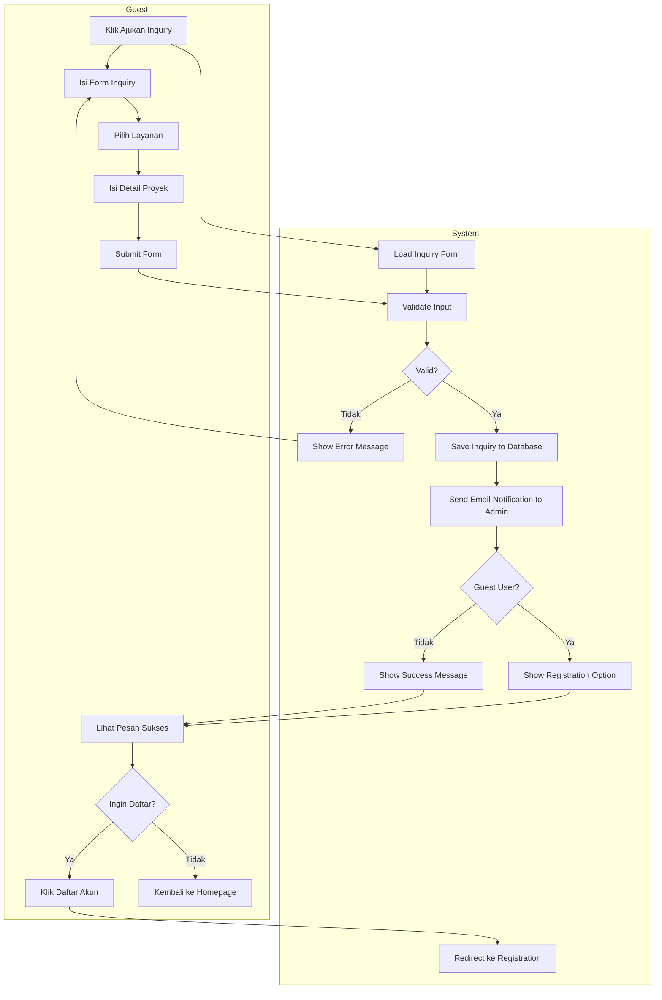

# 🔄 Activity Diagram - ARDFYA v2.1

## 📋 Overview Activity Diagram

Activity Diagram ARDFYA v2.1 menggambarkan alur aktivitas untuk setiap menu dan fitur utama sistem dengan pembagian yang jelas antara **User** dan **System**. Diagram menggunakan format **swimlane** dengan kolom terpisah untuk setiap aktor.

## 🎯 Activity Diagram: Guest - Lihat Homepage

```mermaid
flowchart TD
    subgraph "Guest"
        A[Akses Website] --> B[Klik Menu Homepage]
    end
    
    subgraph "System"
        C[Load Homepage Route] --> D[HomeController@index]
        D --> E[Query Active Services]
        E --> F[Query Featured Portfolios]
        F --> G[Render Homepage View]
    end
    
    subgraph "Guest"
        H[Lihat Layanan] --> I[Lihat Portfolio]
        I --> J{Tertarik?}
        J -->|Ya| K[Klik Ajukan Inquiry]
        J -->|Tidak| L[Browse Lebih Lanjut]
    end
    
    subgraph "System"
        M[Redirect ke Form Inquiry]
    end
    
    B --> C
    G --> H
    K --> M
```

## 🎯 Activity Diagram: Guest - Ajukan Inquiry



## 🎯 Activity Diagram: Customer - Login dan Dashboard

```mermaid
flowchart TD
    subgraph "Customer"
        A[Akses Halaman Login] --> B[Input Email & Password]
        B --> C[Klik Login]
    end
    
    subgraph "System"
        D[Load Login Form] --> E[Validate Credentials]
        E --> F{Valid?}
        F -->|Tidak| G[Show Error Message]
        F -->|Ya| H[Create Session]
        H --> I[Check User Role]
        I --> J{Role Customer?}
        J -->|Ya| K[Redirect to Customer Dashboard]
        J -->|Tidak| L[Redirect to Admin Dashboard]
    end
    
    subgraph "Customer"
        M[Lihat Dashboard] --> N[Lihat Project Progress]
        N --> O[Lihat Inquiry Status]
        O --> P[Lihat Notifikasi]
    end
    
    subgraph "System"
        Q[CustomerDashboardController@index] --> R[Query User Projects]
        R --> S[Query User Inquiries]
        S --> T[Query Notifications]
        T --> U[Render Dashboard View]
    end
    
    A --> D
    C --> E
    G --> B
    K --> Q
    U --> M
```

## 🎯 Activity Diagram: Customer - Chat dengan Admin

```mermaid
flowchart TD
    subgraph "Customer"
        A[Klik Menu Chat] --> B[Lihat Riwayat Chat]
        B --> C[Tulis Pesan Baru]
        C --> D[Klik Send]
    end
    
    subgraph "System"
        E[Load Chat Interface] --> F[ChatController@getMessages]
        F --> G[Query Chat History]
        G --> H[Return JSON Response]
        
        I[ChatController@store] --> J[Validate Message]
        J --> K{Valid?}
        K -->|Tidak| L[Return Error]
        K -->|Ya| M[Save to Database]
        M --> N[Broadcast via Pusher]
        N --> O[Send Notification to Admin]
    end
    
    subgraph "Customer"
        P[Lihat Pesan Terkirim] --> Q{Ada Balasan?}
        Q -->|Ya| R[Lihat Balasan Admin]
        Q -->|Tidak| S[Tunggu Balasan]
    end
    
    subgraph "System"
        T[Real-time Update via Echo] --> U[Update Chat Interface]
    end
    
    A --> E
    H --> B
    D --> I
    L --> C
    O --> T
    U --> R
```

## 🎯 Activity Diagram: Admin - Kelola Inquiry

```mermaid
flowchart TD
    subgraph "Admin"
        A[Login ke Admin Panel] --> B[Klik Menu Inquiry]
        B --> C[Lihat Daftar Inquiry]
        C --> D[Pilih Inquiry]
        D --> E[Review Detail]
        E --> F{Keputusan?}
        F -->|Approve| G[Klik Convert to Project]
        F -->|Reject| H[Update Status Rejected]
        F -->|Need Info| I[Add Admin Notes]
    end
    
    subgraph "System"
        J[AdminMiddleware Check] --> K[AdminInquiryController@index]
        K --> L[Query All Inquiries]
        L --> M[Render Inquiry List]
        
        N[AdminInquiryController@show] --> O[Query Inquiry Detail]
        O --> P[Render Detail View]
        
        Q[AdminInquiryController@convertToProject] --> R[Create New Project]
        R --> S[Update Inquiry Status]
        S --> T[Send Notification to Customer]
        
        U[AdminInquiryController@update] --> V[Update Inquiry Data]
        V --> W[Save to Database]
    end
    
    subgraph "Admin"
        X[Lihat Hasil Update] --> Y{Lanjut?}
        Y -->|Ya| Z[Pilih Inquiry Lain]
        Y -->|Tidak| AA[Kembali ke Dashboard]
    end
    
    A --> J
    B --> K
    M --> C
    D --> N
    P --> E
    G --> Q
    H --> U
    I --> U
    T --> X
    W --> X
    Z --> C
```

## 🎯 Activity Diagram: Admin - Kelola Project

```mermaid
flowchart TD
    subgraph "Admin"
        A[Klik Menu Project] --> B[Lihat Daftar Project]
        B --> C{Action?}
        C -->|Create New| D[Klik Create Project]
        C -->|Edit Existing| E[Pilih Project]
        C -->|Update Progress| F[Klik Update Progress]
    end
    
    subgraph "System"
        G[AdminProjectController@index] --> H[Query All Projects]
        H --> I[Render Project List]
        
        J[AdminProjectController@create] --> K[Load Create Form]
        K --> L[Query Users & Services]
        
        M[AdminProjectController@store] --> N[Validate Input]
        N --> O{Valid?}
        O -->|Tidak| P[Return Validation Errors]
        O -->|Ya| Q[Save Project to Database]
        Q --> R[Generate Contract if Needed]
        R --> S[Send Notification to Customer]
        
        T[AdminProjectController@updateProgress] --> U[Update Progress Percentage]
        U --> V[Save Timeline Details]
        V --> W[Broadcast Update]
    end
    
    subgraph "Admin"
        X[Isi Form Project] --> Y[Submit Form]
        Z[Lihat Project Tersimpan] --> AA[Update Progress]
        AA --> BB[Input Progress %]
        BB --> CC[Upload Photo Progress]
        CC --> DD[Save Progress]
    end
    
    A --> G
    I --> B
    D --> J
    L --> X
    Y --> M
    P --> X
    S --> Z
    F --> T
    DD --> T
    W --> Z
```

## 🎯 Activity Diagram: Admin - Generate Kontrak

```mermaid
flowchart TD
    subgraph "Admin"
        A[Pilih Project] --> B[Klik Generate Contract]
        B --> C[Isi Detail Kontrak]
        C --> D[Set Contract Amount]
        D --> E[Set Timeline]
        E --> F[Submit Contract]
    end
    
    subgraph "System"
        G[AdminContractController@create] --> H[Load Contract Form]
        H --> I[Query Project Details]
        I --> J[Pre-fill Form Data]
        
        K[AdminContractController@store] --> L[Validate Contract Data]
        L --> M{Valid?}
        M -->|Tidak| N[Return Validation Errors]
        M -->|Ya| O[Generate Contract Number]
        O --> P[Save Contract to Database]
        P --> Q[Generate PDF Contract]
        Q --> R[Send Notification to Customer]
    end
    
    subgraph "Admin"
        S[Lihat Contract Tersimpan] --> T{Generate PDF?}
        T -->|Ya| U[Klik Generate PDF]
        T -->|Tidak| V[Kembali ke Project]
    end
    
    subgraph "System"
        W[AdminContractController@generatePDF] --> X[Load Contract Data]
        X --> Y[Generate PDF using DomPDF]
        Y --> Z[Return PDF Response]
    end
    
    A --> G
    J --> C
    F --> K
    N --> C
    R --> S
    U --> W
    Z --> S
```

## 🎯 Activity Diagram: Customer - Lihat Project Progress

```mermaid
flowchart TD
    subgraph "Customer"
        A[Login ke Dashboard] --> B[Klik Menu Projects]
        B --> C[Lihat Daftar Project]
        C --> D[Pilih Project]
        D --> E[Lihat Detail Progress]
        E --> F[Lihat Timeline]
        F --> G[Lihat Photo Progress]
    end
    
    subgraph "System"
        H[Customer\DashboardController@index] --> I[Query Customer Projects]
        I --> J[Render Dashboard with Projects]
        
        K[Customer\ProjectController@index] --> L[Query Customer Projects]
        L --> M[Render Project List]
        
        N[Customer\ProjectController@show] --> O[Query Project Detail]
        O --> P[Query Project Timeline]
        P --> Q[Query Project Photos]
        Q --> R[Update customer_last_viewed]
        R --> S[Render Project Detail]
    end
    
    subgraph "Customer"
        T[Lihat Progress %] --> U[Lihat Budget Usage]
        U --> V{Ada Update?}
        V -->|Ya| W[Lihat Update Terbaru]
        V -->|Tidak| X[Chat dengan Admin]
    end
    
    subgraph "System"
        Y[Real-time Update Check] --> Z[Broadcast if Updated]
        Z --> AA[Update UI]
    end
    
    A --> H
    J --> B
    B --> K
    M --> C
    D --> N
    S --> E
    W --> Y
    X --> Y
    AA --> T
```

## 📊 Penjelasan Detail Activity Diagram

### **1. Guest Activities**

#### **Homepage Browsing**
- **User Action**: Akses website dan navigasi
- **System Response**: Load data layanan dan portfolio dari database
- **Business Logic**: Tampilkan hanya layanan aktif dan portfolio featured
- **Next Step**: Redirect ke inquiry form jika tertarik

#### **Inquiry Submission**
- **User Action**: Isi dan submit form inquiry
- **System Response**: Validasi, simpan data, kirim notifikasi
- **Business Logic**: Guest dapat submit tanpa registrasi, tapi ditawarkan untuk daftar
- **Integration**: Email notification ke admin, optional registration

### **2. Customer Activities**

#### **Authentication Flow**
- **User Action**: Login dengan kredensial
- **System Response**: Validasi dan create session
- **Business Logic**: Role-based redirect (customer vs admin)
- **Security**: Session management dan CSRF protection

#### **Dashboard Interaction**
- **User Action**: Navigasi dashboard dan menu
- **System Response**: Query data personal dan render views
- **Business Logic**: Tampilkan hanya data milik customer
- **Real-time**: Update notifikasi dan progress

#### **Communication Flow**
- **User Action**: Chat dengan admin
- **System Response**: Real-time message handling
- **Business Logic**: Broadcast message, notification, history
- **Technology**: Laravel Echo + Pusher integration

### **3. Admin Activities**

#### **Inquiry Management**
- **User Action**: Review dan process inquiry
- **System Response**: CRUD operations dan workflow
- **Business Logic**: Convert inquiry to project, status tracking
- **Notification**: Customer notification pada status change

#### **Project Management**
- **User Action**: Create, update, monitor projects
- **System Response**: Database operations dan file handling
- **Business Logic**: Progress tracking, timeline management
- **Integration**: Contract generation, customer notification

#### **Contract Generation**
- **User Action**: Create dan manage contracts
- **System Response**: PDF generation dan storage
- **Business Logic**: Auto contract number, template system
- **Technology**: DomPDF integration untuk PDF generation

## 🔄 Alur Integrasi Antar Activity

### **1. Inquiry → Project → Contract Flow**
```
Guest Inquiry → Admin Review → Project Creation → Contract Generation → Customer Notification
```

### **2. Communication Flow**
```
Customer Message → Real-time Broadcast → Admin Notification → Admin Reply → Customer Update
```

### **3. Progress Tracking Flow**
```
Admin Update → Database Save → Real-time Broadcast → Customer Dashboard Update
```

## 🎯 Key Business Rules

### **1. Authentication Rules**
- Guest dapat submit inquiry tanpa login
- Customer hanya dapat akses data pribadi
- Admin memiliki akses penuh dengan AdminMiddleware

### **2. Workflow Rules**
- Inquiry dapat diconvert menjadi project
- Project dapat generate contract
- Progress tracking real-time untuk customer

### **3. Communication Rules**
- Chat real-time dengan file attachment support
- Notification multi-channel (database, email)
- Message history tersimpan permanent

### **4. Data Access Rules**
- Customer hanya lihat data pribadi
- Admin dapat akses semua data
- Guest hanya akses data publik

---

**Activity Diagram ARDFYA v2.1** menggambarkan **alur kerja yang efisien** dengan **pembagian tanggung jawab yang jelas** antara User dan System untuk mendukung **business process** konstruksi dan arsitektur yang **terintegrasi** dan **user-friendly**. 🔄
