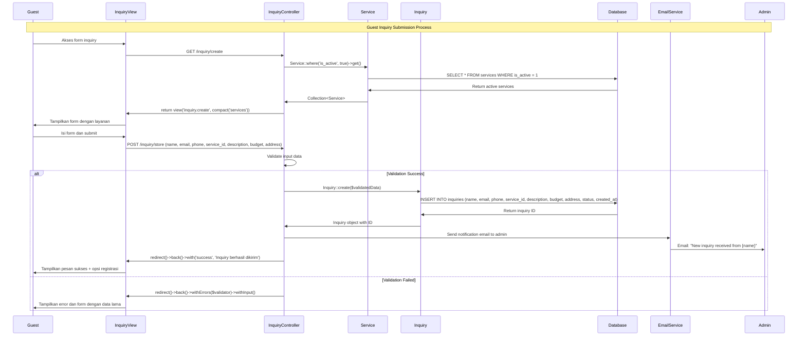
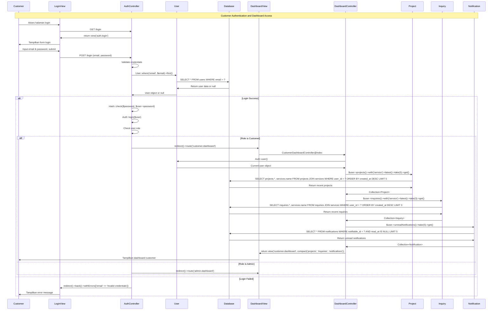
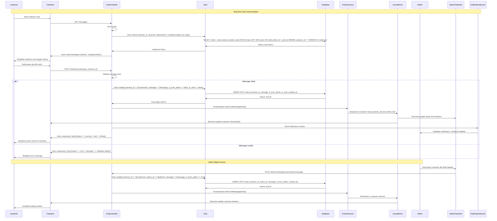
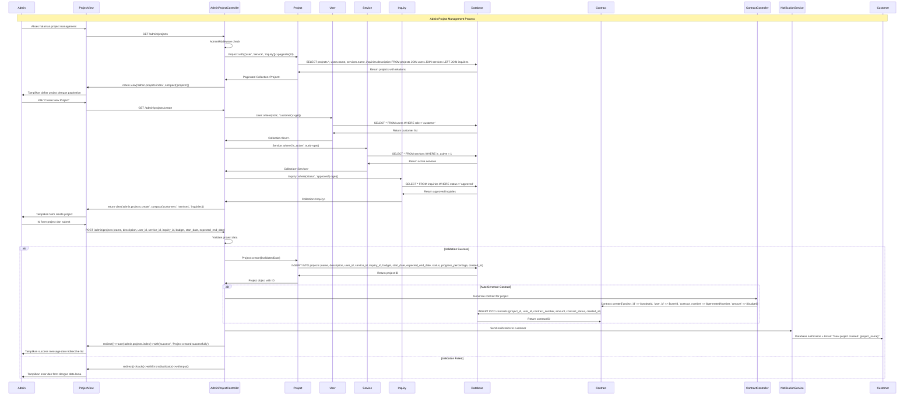
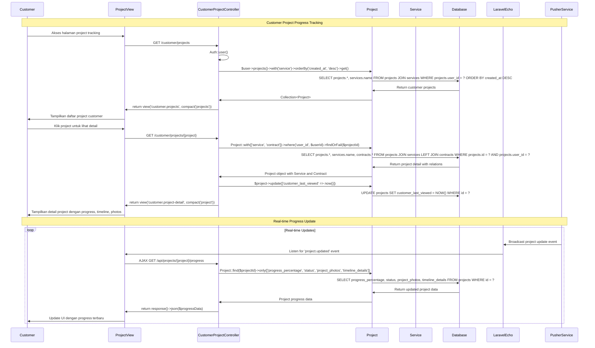

# 🔄 Sequence Diagram - ARDFYA v2.1

## 📋 Overview Sequence Diagram

Sequence Diagram ARDFYA v2.1 menggambarkan interaksi antar objek dalam urutan waktu untuk setiap proses bisnis utama. Diagram mencakup **Aktor**, **View**, **Controller**, **Model**, dan **Database** dengan atribut dan method yang relevan sesuai Class Diagram.

## 🎯 Sequence Diagram: Guest Ajukan Inquiry



## 🎯 Sequence Diagram: Customer Login dan Dashboard



## 🎯 Sequence Diagram: Customer Chat dengan Admin



## 🎯 Sequence Diagram: Admin Kelola Project



## 🎯 Sequence Diagram: Admin Generate PDF Kontrak

```mermaid
sequenceDiagram
    participant A as Admin
    participant CV as ContractView
    participant CC as AdminContractController
    participant C as Contract
    participant P as Project
    participant U as User
    participant DB as Database
    participant PDF as DomPDFService
    participant FS as FileSystem
    
    Note over A,FS: Contract PDF Generation Process
    
    A->>CV: Klik "Generate PDF" pada contract
    CV->>CC: GET /admin/contracts/{contract}/pdf
    CC->>CC: AdminMiddleware check
    CC->>C: Contract::with(['project', 'user'])->findOrFail($contractId)
    C->>DB: SELECT contracts.*, projects.*, users.* FROM contracts JOIN projects JOIN users WHERE contracts.id = ?
    DB->>C: Return contract with relations
    C->>CC: Contract object with Project and User
    
    CC->>PDF: PDF::loadView('admin.contracts.pdf-template', compact('contract'))
    PDF->>PDF: Load HTML template with contract data
    PDF->>PDF: Apply CSS styling
    PDF->>PDF: Convert HTML to PDF
    
    alt PDF Generation Success
        PDF->>CC: PDF binary data
        CC->>FS: Store PDF file (optional)
        CC->>CV: return response($pdf)->header('Content-Type', 'application/pdf')->header('Content-Disposition', 'attachment; filename="contract-{contract_number}.pdf"')
        CV->>A: Download PDF file
    else PDF Generation Failed
        PDF->>CC: Exception thrown
        CC->>CV: redirect()->back()->with('error', 'Failed to generate PDF')
        CV->>A: Tampilkan error message
    end
```

## 🎯 Sequence Diagram: Customer Lihat Progress Project



## 📊 Penjelasan Detail Sequence Diagram

### **1. Object Interactions**

#### **Controller Layer**
- **InquiryController**: Menangani form inquiry dan validasi
- **AuthController**: Proses authentication dan session management
- **AdminProjectController**: CRUD operations untuk project management
- **ChatController**: Real-time messaging dengan broadcasting

#### **Model Layer**
- **User**: Authentication, relationships, role checking
- **Project**: Business logic, progress tracking, relationships
- **Chat**: Message storage, real-time broadcasting
- **Contract**: PDF generation, business calculations

#### **Service Layer**
- **EmailService**: Notification delivery
- **PusherService**: Real-time broadcasting
- **DomPDFService**: PDF document generation
- **NotificationService**: Multi-channel notifications

### **2. Database Interactions**

#### **Query Patterns**
- **Eager Loading**: `with()` untuk optimize N+1 queries
- **Filtering**: `where()` clauses untuk data access control
- **Pagination**: `paginate()` untuk large datasets
- **Relationships**: JOIN queries untuk related data

#### **Data Integrity**
- **Foreign Key Constraints**: Referential integrity
- **Validation**: Input validation sebelum database operations
- **Transactions**: Atomic operations untuk complex workflows

### **3. Real-time Features**

#### **Broadcasting Flow**
```
User Action → Controller → Database → Broadcast Event → Pusher → Laravel Echo → UI Update
```

#### **Notification Flow**
```
System Event → Notification Service → Database Storage → Email Service → User Notification
```

### **4. Security Implementations**

#### **Authentication Flow**
- **Credential Validation**: Hash comparison
- **Session Management**: Laravel session handling
- **Role-based Access**: AdminMiddleware untuk authorization

#### **Data Protection**
- **Input Validation**: Form request validation
- **SQL Injection Prevention**: Eloquent ORM protection
- **CSRF Protection**: Built-in Laravel protection

### **5. Performance Optimizations**

#### **Database Optimization**
- **Eager Loading**: Reduce N+1 query problems
- **Indexing**: Foreign key dan frequently queried columns
- **Pagination**: Limit result sets untuk performance

#### **Caching Strategy**
- **Query Caching**: Cache frequent database queries
- **View Caching**: Cache compiled templates
- **Session Caching**: Optimize session storage

## 🔄 Integration Points

### **1. Frontend-Backend Integration**
- **AJAX Calls**: Real-time data updates
- **Form Submissions**: POST requests dengan validation
- **File Uploads**: Multipart form handling

### **2. External Service Integration**
- **Email Service**: SMTP integration untuk notifications
- **Pusher Service**: WebSocket untuk real-time features
- **PDF Service**: DomPDF untuk document generation

### **3. Database Integration**
- **Eloquent ORM**: Object-relational mapping
- **Migration System**: Database version control
- **Seeder System**: Test data generation

---

**Sequence Diagram ARDFYA v2.1** menggambarkan **interaksi detail** antar komponen sistem dengan **timing yang akurat** dan **data flow yang jelas** untuk mendukung **business process** yang **efisien** dan **reliable**. 🔄
